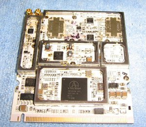

Mesh networks using 2.4 or 5 Ghz wifi are becoming popular, and are very
practical in densely populated areas. But it would be good to have
something more robust for very rural areas.

A way to get around the range limitations of 2.4 Ghz wifi, could be to
convert it directly down to a lower frequency, meaning we no longer have
the near line-of-sight limitation of typical 802.11. A couple of
wireless cards are able to do just this. They the take 2.4GHz system,
remove the 2GHz, leaving 400MHz. On the software side it continues to
function with the 2.4GHz channel system. There is an amateur band just
above 400Mhz - the International Telecommunications Union allocates
430-440MHz for amateurs, and in some countries its wider. However the
use of highbandwith data transmission on this band remains a legal grey
area.  Singapore based Doodle labs produce
the [DL435-30 transceiver
board](http://doodlelabs.com/products/sub-ghz-range/420-450-mhz-band-dl435.html)
and Canadian XAGYL Communications produce the
[XC420M](http://www.xagyl.com/store/product.php?productid=16450&cat=251&page=1).
Both are mini PCI cards which operate at 420-450MHz and can work with
linux wifi drivers. The problem is bandwidth; at microwave frequencies
the 10MHz or 20MHz wide channels used by 802.11 wifi is not much, but at
400MHz it is a big chunk of the spectrum and likely to interfere with
other things - many common radio controlled devices (for example garage
doors) operate on 433MHz. Luckily it is possible to configure 802.11 to
squeeze into 5Mhz, of course compromising transmission rate.

-   [70cm amateur band english wikipedia
    article](http://en.wikipedia.org/wiki/70-centimeter_band)
-   [Modifying Consumer Off the Shelf Wireless LAN devices for
    specialized amateur
    use](http://www.qsl.net/kb9mwr/projects/wireless/modify.html) This
    article has a section on the 70cm band

The advantage, compared with packet radio or other data transmission
techniques is that the hardware/firmware/software for 802.11 systems is
already widely used and needs only modifying slightly. The computer
'sees' the 430MHz wireless card as a normal 2.4GHz wifi device, with the
usual channels etc.

##### software

The cards 'appear' to be normal 2.4GHz wifi cards, so not many software
changes are required. The Ubiquiti Routerstation, comes with OpenWRT
Kamikaze. Most of the experiments I have read about use
[DD-wrt](http://www.dd-wrt.com), which has an easy to use web-based
interface with a build in option to change the channel with to 10 or 5
MHz (necessary on 430MHz). However, DD-WRT is commercial software, not
open source, and the trial version does not allow ssh access to the
router. nbd from the OpenWRT project gave quick instructions on how to
get the routerstation working with the DL435-30 with a 5MHz channel
width, after flashing the firmware from
[<http://downloads.openwrt.org/snapshots/trunk/ar71xx/>](http://downloads.openwrt.org/snapshots/trunk/ar71xx/)

    opkg update
    
    # install the right wireless driver
    opkg install kmod-ath5k
   
    # re-run wifi device detection
    wifi detect > /etc/config/wireless
    
    # edit /etc/config/wireless, enable wifi, set
    # 'option chanbw 5'

It is also useful to install the [LuCI](http://luci.subsignal.org) web
user interface.

##### antennas

A simple 1/4 wave antenna is around 14cm long (depending on the channel
used). The links below show some other designs.

-   [6 Element directional
    yagi](http://users.skynet.be/deswert.luc/70%20cm%206%20element%20beam.htm)
-   [DXzone's 70cm antenna
    links](http://www.dxzone.com/catalog/Antennas/70cm/)
-   [440mhz j-pole
    design](http://www.mikestechblog.com/joomla/component/content/article/43-ham-radio-antennas/62-70-cm-440-mhz-j-pole-construction-plans.html)
-   [Build A 9 dB, 70cm, Collinear Antenna From
    Coax](http://www.rason.org/Projects/collant/collant.htm)

##### amplifiers for 70cm

The UK foundation amateur power limit on this band is 10w. Anywhere
other than extremely remote countryside, using these frequencies for
this kind data transfer would probably cause interference with other
amateurs. Even with 5Mhz channels, this is a considerable chunk of the
band. Therefore using amplifiers is perhaps not a great idea. It is also
not clear if this equipment would be damaged by such high power signals.

That said, the links below are to build a considerably more powerful
amplifier. This is clearly not a good idea! But probably a similar
design could be used with lower power mosfets.

-   [500w 70cm amplifier
    kit](http://www.w6pql.com/500w_70cm_amplifier.htm) and [assembly
    guide](http://www.w6pql.com/70cm/500wassembly.htm)
-   [the mosfet datasheet](http://www.w6pql.com/70cm/MRFE6VP5600H.pdf)
-   [rfham.com](http://www.rfham.com/) has prebuilt Module PA 432MHz
    500W

##### other stuff

-   [WiMAX Demo Shows a 50km Broadband Internet Connection at
    450MHz](http://www.cellular-news.com/story/30536.php) Telsima on
    cellular news
-   [70cm ATV History and case for modified future HSMM
    use](http://qsl.net/kb9mwr/projects/wireless/70cm-ATV-HSMM.html)
    Mostly talks about lisencing issues in the US but has some ideas
    about data networks on 70cm
-   [Power over
    ethernet](http://en.wikipedia.org/wiki/Power_over_Ethernet)
-   [Using the raspberry pi to transmit camera
    images](http://www.daveakerman.com/?p=592) This project also uses
    the 430MHz amateur band, but at 300 baud, using the [Radiometrix
    NTX2](http://www.radiometrix.com/content/ntx2)
-   [spiderbeam](http://www.spiderbeam.com) make and sell fibreglass
    antenna masts up to 26m high

