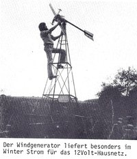

This section is included because energy autonomy is important for
community run communication networks.

- [appropedia](http://www.appropedia.org) wiki for sustainablity and 'appropriate' technology
- [12volthandbook.pdf](http://www.dawncraftowners.com/12volthandbook.pdf)
    a text focusing on 12v systems for boats

Wind
----

 Many designs of wind
generators are available. Magnets from microwave ovens can be used.
These are usually set into resin to stop them flying off which can be
very dangerous. Static coils and moving magnets get around the problem
of needing brushes like in electric motors. The blades can be carved out
of hard wood.

-   [scoraigwind](http://www.scoraigwind.com/) hugh pigotts website
-   [pdf hugh pigott scoraig wind electric](http://practicalaction.org/docs/energy/pmg_manual.pdf)

Pedal generators
----------------

Car alternators have often been used but they are a bad choice as they
give no voltage at low speeds and so need gearing. Belts from tractors
([UK supplier for the tractor belts](http://www.forge-services.co.uk/))
have been used between the rear bike wheel and the alternator. However
DC motors give much better results. These can be bought new but are
expensive. Car windscreen wiper motors could possibly be used.

[tim's pedal generator](tims_pedal_generator.md) using dc motor
and cycle training stand (originally on leeds-alternative-energy
wikispace which has now been deactivated).

### hand generators from stepper motors

For a mini version, stepper motors from printers and other
electromechanical devices will give AC power at very low speeds. It can
be interesting to play with leds and turning the motor by hand. They
have multiple sets of coils, to allow the printer to make high-precision
movements, which is why they have so many connections, and you will need
to experiment to find which pins can be connected together to a to a
bridge rectifier of four diodes to give maximum DC output.

-   [generating electricity with stepper
    motors](http://www.c-realevents.demon.co.uk/steppers/stepmotor.html)
-   [hack a week stepper motor
    generator](http://hackaweek.com/hacks/?p=595)

hub dynamos
-----------

Hub dynamos are small generators in the centre of a bike wheel, used to
create power whilst cycling, which traditionally was done by a DC dynamo
in direct contact with the tyre. They often produce AC and are usually
used for powering lights, but can be used for other things too, such as
amplifiers or radios.

-   [Hub dynamo wikipedia
    article](http://en.wikipedia.org/wiki/Hub_dynamo)
-   [Voltage regulated 5v bicycle dynamo light
    USB](http://www.instructables.com/id/Voltage-Regulated-5-V-Bicycle-Dynamo-Light-USB/) -
    plans for a circuit to give 5v DC output (like you get from a
    USB port) from the dynamo hub.
-   [Usb as a power
    source](http://www.girr.org/mac_stuff/usb_stuff.html) is a good text
    about powering various things using 5v USB. It is worth also
    mentioning that its possible to buy very cheap circuits for stepping
    up 3.7v lithium ion batteries (commonly found in mobile phones)
    to 5v. Meaning you can use batteries from any old phone to charge
    other phones or other devices. Could be useful on a long
    cycling trip.

Solar panels
------------

Solar panels are a simple and robust power solution but their production
is energy-intensive and polluting. They can be stolen quite easily but
there are roumours that some contain hidden chips which can be used to
track their position.

### Regulators 

Maximum power point tracking (mppt) regulators are the more efficient
but expensive. Cheaper 'PWM' regulators will allow the battery state to
determine voltage which may not be the most efficient for the panel.
MPPT regulators use a control circuit to 'search' for the voltage
allowing the highest power output.

Another advantage of MPPT regulators is that it is possible to charge a 12v
battery from 24v panel or potentially a 24v battery
from a 12v panel (works with for example 'emponi sol1').

Note that some regulators sold as 'MPPT' are not actually MPPT.  Read reviews of the model you are considering buying, particularly if it seems cheap.  True MPPT controllers can usuallly be identified by a large inductor in the circuit.  

Of course when using solar panels it is better to use electrical
appliances during the day when more power is available. The cheaper
regulators will even cut out and stop charging the battery when the
voltage goes too high (when its very sunny), so its good to have
something connected if this is the case.

### Inverters

If using inverters, it is usually better to connect them to the 'battery' terminals of the regulator (or to the battery itself) rather than the 'load' ouput terminals.  This is because regulators will usually have their own system of switching off in the case of voltage becoming too low, and they are designed to be switch at such high currents.  Allowing the regulator itself to switch such a high load could damage it, especially if it is a cheap regulator.

When buying an inverter, it is worth looking for a 'pure sine wave' one, but it is hard to know if it is really pure sine wave without testing it with an oscilloscope.  Many cheaper inverters will work fine running lights and power tools, but will not work well with electronics, charging laptops etc.  It can be better to simply use 12v (car) adaptor for laptops, phones etc.

-   [building solar panels from cells from damaged solar panels](http://www.mdpub.com/SolarPanel/index.html) many people do
    this, the cells can be bought from solar panel manufacturers
    or online. But it is much work.

soldering without mains electricity
-----------------------------------

12v DC soldering irons, which can be run from batteries, are available.
But for situations where you do not have enough power to use an electric
soldering iron, a butane gas powered soldering can be used (eg:'Power
probe'), which can be refilled just like a butane cigarette lighter. A
simpler, but considerably less effective solution could be just to heat
nails in a fire and use pliers to hold them for soldering.

It is also roumoured that pine tree sap can be used to make flux, which
is used to make solder flow more freely.

-   [DIY flux comes straight from the tree | Hackaday](http://hackaday.com/2012/09/19/diy-flux-comes-straight-from-the-tree/)

batteries
---------

It is best to use 'deep cycle' or 'leisure' batteries rather than car
batteries as they are designed to be dischared deeper. However car
batteries can be used if they are the only thing available and it is the
battery itself which will be damaged by discharging it, not the
appliances you attach.

Often batteries can be improved simply by adding distilled water.
Batteries which appear sealed can often be opened by forcing open a
plastic panel to reveal little lids to the individual cells.

Old lead-acid batteries which will no longer hold a charge can be often
rejuvinated by pulse charging them to de-sulphate the cells, provided
they have not shorted out as a result of a buildup of lead deposits in
the bottom of the battery.

As a last resort, it is possible to use old car batteries which no
longer will charge to 12v (which you often find discarded) as 9v
batteries, which can power, for example, 3 led bike lights soldered
together in series (2xAAA batteries=3v) to get the last bit of use out of
them.

Large 180ah truck-style batteries can often be found in tempory traffic
lights used for roadworks. However there are roumours that these
sometimes contain chips so that their location can be tracked if stolen.

Electric wheelchairs usually use very good sealed batteries. It could be
a good idea to try asking at shops and companies who sell or service
electric wheelchairs for old batteries.

Security and fire alarms also often have good quality sealed batteries as backup power,
these can often be found in abandoned buildings or try asking
manufacturers for old ones. The smaller ones will power LED lighting for a useful
amount of time and are small enough to carry in a rucksack to charge
elsewhere, so perfect for when you have several people sharing one solar
panel.

-   [lead acid battery information](http://www.alton-moore.net/batteries.html) including
    plans for a pulse charger
-   [Battery regenerator wikipedia articlue](http://en.wikipedia.org/wiki/Battery_regenerator)
-   [bedini simplified schoolgirl battery restorer](http://www.thediyworld.com/ssg-battery-restorer.php) this
    is a more complicated motor system.
-   [bedini ssg battery restorer plans](http://rpmgt.org/JoinBediniList.htm)
-   [12 volt gel cell charger plans](http://www.rason.org/Projects/gelcell/gelcell.htm)
-   [Joule thief](http://en.wikipedia.org/wiki/Joule_thief)

### alum batteries

Alum is the stuff deodourant stones are made from. It is also sold as a
food additive used to keep pickles crisp. Apparently it can also be used
as a water purifier. So it is less environmentally damaging than
sulphuric acid. Some people (notably John Bedini) have reported emptying
the acid from batteries and refilling them with alum solution. There is
some controversy on internet forums about the advantages of alum
batteries, it seems it is an area which needs further experimentation.
Some say that:

-   acid batteries discharge slowly to begin with, then at a
    greater rate. alum batteries reach a low voltage plateau where a
    small current can be taken for a suprisingly long time.
-   Alum batteries have a lower power density than acid batteries.
    Meaning you need a heavier battery to get the same amount of power
    (a disadvantage). This makes than more suitable for static,
    long-term systems.
-   Alum batteries charge faster than acid batteries.
-   The terminals of alum battteries will never corrode (a common
    problem with acid batteries)
-   Alum batteries can be discharged deeper without reducing
    their lifetime.
-   Alum batteries have a longer lifetime. This can be because the lead
    is not corroded (eventually resulting in a short circuit caused by
    lead deposits). Also possibly because sulphation of the plates does
    not occur.

-   [Alum batteries](http://www.hho4free.com/bedini_alkaline_battery.htm)
-   [youtube video making alum battery](http://www.youtube.com/watch?v=iWbHcWxd4Xc)
-   [rexresearch.com Alum-Lead Battery Conversion](http://www.rexresearch.com/articles2/alpbatty.htm)
-   [blog.hasslberger.com How to convert a lead acid battery to alkaline](http://blog.hasslberger.com/2007/01/how_to_convert_a_lead_acid_bat.html)

lighting
--------

LEDs can be cheaper when bought in strips, for example 5630 SMD white
LEDS can be bought in rolls of 5 or 10m, for 12v systems use multiples
of 3 LEDs.

When using headtorches, remember when replacing the batteries that they often
discharge irregularly, the light will go dim when just one of the
batteries is low, so test them with a volt meter and usually you will
only replace one of them.  This also means that batteries discarded by other people are worth testing.

Thermoelectrical generators
---------------------------

Small heat powered electrical generators that can be attached for
example to a wood burner. They dont produce a lot of power but could be
useful for powering electronics stuff.

-   [thermoelectrical generator wikipedia article](http://en.wikipedia.org/wiki/Thermoelectric_generator)
-   [thermalforce.de](http://thermalforce.de) site selling them
-   [video of TEG](http://www.youtube.com/watch?v=QKaO3l7iwEA)

wood
----

wood warms you three times. Once when you collect it, once when you chop
it and once when you burn it.

-   [capturing heat 1](http://ehion.com/~ameba/download/capturing-heat-one.pdf)
-   [capturing heat 2](http://ehion.com/~ameba/download/capturing-heat-2-1.pdf)
-   [capturing heat 3](http://ehion.com/~ameba/download/capturing-heat-3.pdf)

biofuels
--------

-   [Algae fuel](http://www.appropedia.org/Algae_fuel) on appropedia

### Electronics repair/salvage/desoldering

-   [sci.electronics.rapair repairfaq.org](http://www.repairfaq.org/REPAIR/F_Repair.html) how to
    repair many things.

-   [car amplifier repair basics](http://www.bcae1.com/repairbasicsforbcae1/repairbasics.htm)
    much information on this site
-   [ifitjams.com](http://www.ifitjams.com/) flow chart guides to
    repairing cars and computers

eco construction
----------------

Soon to be its own page.

### earthships

ecoconstruction design by mike reynolds, using car tyres to collect the
heat from south facing windows. The original three volume earthships
book is available on [library genesis](http://gen.lib.rus.ec)

-   [earthship.com](http://earthship.com/)
-   [earthshipeurope.org](http://earthshipeurope.org) organisation
    connecting earthship construction in europe
-   'The Earthship Toolkit. Your Guide to Building a Zero Waste Zero
    Energy Future' book by Susan Kemp and Paula Cowie based on building
    an earthship in Fife, Scotland.
-   'Earthships. Building a zero carbon futures for homes' by Mischa
    Hewitt and Kevin Telfer based on earthship built in Brighton.

