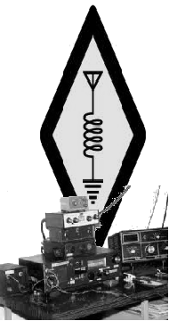
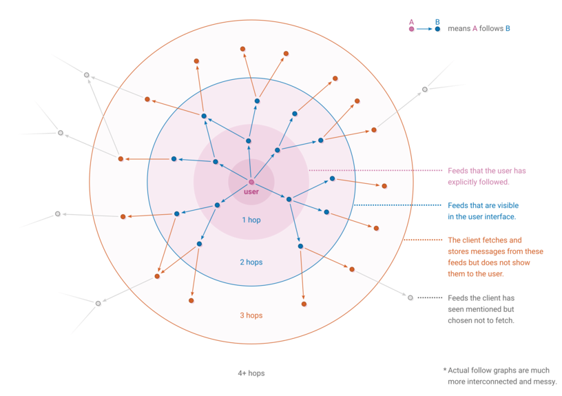
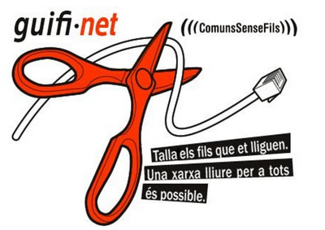
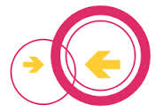
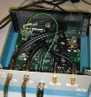
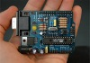
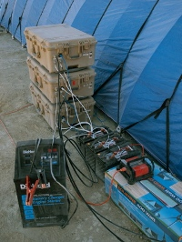
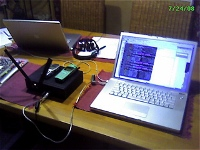
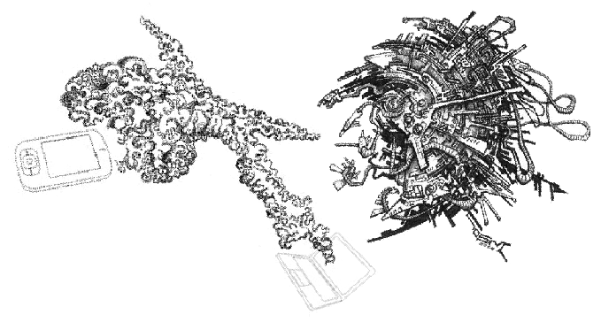

If you choose not to rely on electronic communication, thats great. But
for those of us who do, isn't it time we set up community run
alternatives?

Problems with existing communication networks
=============================================

Gradually, the internet, which once seemed like a relatively free and
user-controlled system – at least compared with totally centralised
TV/radio broadcasting, is becoming a controlled commercial space where
people don't trust each other and we are constantly under the eyes of
authorities and businesses - much like our city centres.

Centralisation of control, censorship, privacy
----------------------------------------------

Two examples: In feburary 2012 the non-profit website 'scroogle' which
offered an alternative version of google (where searches were not
recorded) was taken down after action against it taken by google. Then
in march 2012 google put into practice their new privacy policy, making
users search history available to other google owned sites. Of course
other sites exist which provide secure web searches.

During the uprising in Egypt 2011 there was an internet blackout, making
it clear that such a communication network is valuable for organising
social change but sadly rests in the hands of companies willing to
cooperate with the authorities. Since then the US has began to develop
an 'internet kill switch'. See the [US Open congress bill 'Protecting Cyberspace as a National Asset'](http://www.opencongress.org/bill/111-s3480/text) and indymedia
article [Internet Freedom Fighters Build a Shadow Web](http://www.indymedia.ie/article/101429)

-   [telecomix](http://telecomix.org/)
-   [telecomix wikipedia article](http://en.wikipedia.org/wiki/Telecomix)

-   [La Quadrature du net](http://www.laquadrature.net) association to defend rights and freedom of internet users. Includes much information about [net neutrality](http://www.laquadrature.net/en/Net_neutrality) also see [net neutrality wikipedia article](http://en.wikipedia.org/wiki/Net_neutrality)
-   [accessnow.org](https://www.accessnow.org) campaigns around 'digital
    freedom'

<!-- -->

-   [Telephone portable, gadget de destruction
    massive](http://www.infokiosques.net/spip.php?article267) zine (fr)
    pdf sur infokiosques.net
-   [Ne laissez pas les machines jouer avec les
    enfants](http://www.infokiosques.net/lire.php?id_article=315)
    zine (fr) pdf sur infokiosques.net
-   [quema tu movil](https://quematumovil.pimienta.org/) (Es) zine pdf
    (burn your phone)

<!-- -->

* [p2p foundation](http://p2pfoundation.net) organisation promoting peer to peer practises, 'towards an open and autonomous internet and society'. The site also has an [open hardware directory](http://p2pfoundation.net/Product_Hacking)
* [redecentralize.org](http://redecentralize.org/) a series video interviews about projects which contribute to the decentralisation of communication. See also their [list of alternative internet projects](https://github.com/redecentralize/alternative-internet)
* [federation FDN](http://www.ffdn.org) Fedaration of associative internet service providers in france

ideas for community run communication, new and old
==================================================

In order for a community run network to become popular, it might be
useful to have some universal standards, and a way for different
networks to link together. A small group might use high frequencies to
get high bandwidth communication locally, but how can we connect that
communication with lower frequency, longer range links to other
communities? If we are going to set up some sort of repeaters or base
stations to link groups, they need to be useful to everyone, and not
dependent on other parts of the network. Some repeaters might be
installed in vehicles or boats that move around. Or they might be
dependent or wind or sun for power – so they cannot be always relied
upon.

It is relevant here to question what is important to us in a
communication network. Simply spending time with and talking to people
around you is a very useful way to communicate. Any kind of
centralisation or broadcasting of information could be argued to be
detrimental to the autonomy of individuals and communities. when we look
at examples in 'nature' we can see that beautiful organised structures
come about as the result of a large number of low level interactions.

food and fire
-------------

make food and fire, people come together and communicate.  actually it seems that the more communications technology we have, the less we do this.  a lot of people feel really isolated, even though they have worldwide communication devices.

Language
--------

Language is an important communication tool. Like other aspects of our
culture, it is becoming more homogenised and less diverse. There are
many examples of when a common language has been used as a way for a
minority to have power over many, and of when speakers of other
languages or dialects are oppressed. Language homogeny is a structure
used to create a national identity and recognition of and obedience to a
national state. Many revolts and uprisings have been possible because of
a refusal to use the majority language. In recent times, the
globalisation of the market and of communications infrastructure (for
example the internet) mean even more homogeny of language, allowing even
more centralisation of control by a minorty. Of course, using a common
language improves relations between communities, but when this is forced
or imposed my a minority there will always be some kind of communication
breakdown, a loss of some culture, ideas or knowledge, and somebody will
be more isolated. Thats not to say we should not learn popular languages
and use them to network with far away friends, but that we must
recognise that divirsity of language is important in maintaining
decentralised social control.

* Book: 'When languages die - the extinction of the world's languages and the erosion of human knowledge' K. David Harrison 2007 Oxford University press

[storytelling](http://en.wikipedia.org/wiki/Storytelling) and folklore
----------------------------------------------------------------------

Stories, tales and songs are a way to memorise ideas so they can be passed between groups
and between generations.

Post
----

Write a letter, and give it to someone who is travelling the direction you want it to go.  Like all communication systems, the provision of a postal service has often been a way to exert control. 

Community notice boards
-----------------------

A simple way to communicate in a group is to leave a written or
pictorial message for others to see. A way of making it weatherproof is
usually needed.

Printing
--------

Some would argue that the invention of the printing press, meaning that
information could be mass produced, was a hindrence to our diversity of
ideas. There are no doubt problems brought about by any kind of
mechanism which allows a minority to speak to the masses. But of course
they can also be very important and empowering community tools.

-   [Toner refill - wikipedia article](http://en.wikipedia.org/wiki/Toner_refill) on refilling
    photocopier or laser printer toner
-   [Printer and Photocopier Troubleshooting and Repair Collection](http://repairfaq.ece.drexel.edu/samnew/printfaq.htm)

radio
-----

The radio spectrum, like other kinds of space, has been divided into
discrete parts of which the majority is resverved for authorities, military, or companies who will
sell it back to us to use.  To use it in a genuinely decentralised way we
might need to disrespect the idea of bandwidth ownership.

### amateur radio

 'amateur' radio communication has
existed for over a hundred years. It is both a local and an
international network and has often been relied upon when other
communications have broken down because of disasters such as floods.
Data modulation systems such as
[PSK31](http://en.wikipedia.org/wiki/Psk31) can allow text services
similar to email or sms, which can operate over thousands of miles on
HF. Using the amateur bands requires a lisence and an official
'callsign', which are relatively cheap and easy to get, but there are
some undesirable restrictions. For example, sending encrypted messages
is forbidden, and the lisencing association stores personal details of
its users and will cooperate with governments. Of course we could use
similar systems illegally, but as an existing nework it has the
advantage of having estabilished and well documented international
standards, as well as infrastructure such as repeater stations. The
amateur community emphasises learning and experimentation rather than a
practical everyday communication tool.

-   [AMPRNet](http://en.wikipedia.org/wiki/AMPRNet) Amateur packet radio
    network, also known as hamnet, is the name given to computer
    networks connected by amateur radio links. TCP/IP
    (internet protocol) packet radio networks have existed since before
    the public internet but have never been very popular, partly because
    of bandwidth restrictions (VHF links are commonly limited to
    9600 baud). Interestingly, radio amateurs are allocated a considerable chunk of
    the IPv4 address space (44.0.0.0/8).
-   [Hinternet](https://www.noisebridge.net/wiki/HInternet) on
    noisebridge
-   [High Speed Multimedia Radio](http://en.wikipedia.org/wiki/High-speed_multimedia_radio)
    this article looks at using 802.11 wifi on different amateur bands.

<!-- -->

-   [Low cost E-mail over HF with OFDM and turbo coding.](http://download.ehas.org/misc/articulo_HF.pdf) This
    project looks to be a robust long distance solution. It uses newqpsk
    (or [Q15X25](http://en.wikipedia.org/wiki/Q15X25)) protocol with the
    'soundmodem' software. OFDM seems to be gaining popularity in these
    lower parts of the spectrum, but I have a bit of trouble
    understanding this example, how can a standard HF transciever be
    used with a new and different modulation mode?
-   [QRZ.com](http://www.qrz.com/) callsign database, also forums
    including buying and selling amateur hardware.
-   [chirp](http://chirp.danplanet.com) open source, cross platform,
    radio programming tool (software)
-   [The (chinese) radio documentation project](http://radiodoc.github.io/) produce a
    creative-commons-licensed manual for the Baofeng uv-5r, a low cost
    vhf/uhf handheld amateur radio (2m and 70cm).  The original manual does not explain everything.
-   [CQInet](http://cqinet.sourceforge.net/) open source software VoIP
    internet links for amateur radio. Alternative to IRLP, ILink or
    [echolink](http://www.echolink.org/).

#### Using simple, low cost transcievers for data

 A simple solution can
be to use low cost UHF transmitters/recievers with RTTY. There are some
very cheap transmitters sold on ebay, some sold for use with arduino or
raspberry pi (see issue 8 of [magpi magazine](http://www.themagpi.com/)). The problem is that the cheaper
ones do not support channel selection, so would interfere with each
other.

-   [Radiometrix](http://www.radiometrix.com), based in the UK, make
    quite good quality but still fairly cheap stuff. Also some
    transcievers with chanels selection and more high end radio modems.
-   [Linking an Arduino to a Radiometrix NTX2
    Transmitter](http://ukhas.org.uk/guides:linkingarduinotontx2) this
    guide explains how to connect one of these simple transmitters.

<!-- -->

-   strato -antenna design

### companies selling radio and electronics stuff

-   [wimo antennen and electonik](http://www.wimo.com) (de) This site
    also has some useful help guides in many languages.
-   [stabo.de](http://www.stabo.de) cb kit and antennas\`(de)
-   [cbplus](http://cbplus.com) (fr)
-   [e44](http://e44.com) (fr)
-   [selectronic](http://selectronic.fr) (fr)
-   [yagi.pl](http://yagi.pl/) antennas and other kit for wifi, wimax,
    gsm, umts

# pirate radio broadcast

Pirate radio can be empowering for a community and is a useful tool for
combining art and information. The advantage is that the recievers are
cheap and can be found everywhere. Compared to wifi networks it is much
more practical for recieving in more wild places, fields, gardens,
workshops, meaning we can be doing practical things and not stuck
indoors, while recieving information. Of course there are legal problems with
broadcasting without a lisence, especially if it is done in the city.
But using it in isolated rural areas is something that can definately be
experimented with. As anyone with an FM radio can listen, it can be a
good way to make links with other people who live nearby.

However, we must not forget that the nature of broadcast is that it remains a
one-to-many 'shut up and listen' monologue, traditionally used as an oppressive political tood, and care must be taken that
it remains a project that everyone can participate in.

FM systems will usually use a 1 or 2w 'exciter' to produce the modulated
signal and then an RF amplifier. Many modern systems, especially the
cheaper/lower power ones have the exciter and amplifier all in one box
or even all on one board. 'HLLY' and similar Chinese brands are like
this and are very cheap and simple to use. However they are not very
high quality and not suitable for high power transmissions (more than
say 60w).  Also the more power you are using, the better antenna you need to not damage the transmitter.  Most transmitters have a built in SWR (standing wave ratio) meter to give an indication of how well the antenna is functioning and will normally switch off automatically if a dangerously high amount of power is coming back from the antenna.  Some transmitters will need an external SWR meter. 

Most low power FM transmitters run on 12v DC so are perfect for running
from batteries. If you want to run from the mains electricity and dont
have a transformer, computer power supplies work quite well. If they are
modern ATX ones, you will need to connect the green wire on the
motherboard connector to a black wire to switch it on. Then on each
block of 4 wires you have yellow and black wires to give 12vDC and red
and black to give 5vDC.

#### studio to transmitter audio bridges

Many pirate radio stations use a 'bridge' to link the studio to a remote
transmitter. This is done either for security reasons (not wanting to
get caught at the site of the transmitter) or simply to keep the
transmitter close to the antenna when the antenna is in a difficult to
reach spot (remember, the hieght of the antenna greatly effects the
range). A bridge which gives a lot of range allows you to be very
creative with antenna locations, as the transmitter could be powered by
a small solar panel and battery and put in a very difficult to reach
place. This 'bridge' can be made in various different ways:

-   Using a very **long audio cable**
-   Using a **second, usually lower power, FM broadcast transmitter**
    operating on a different frequency.
-   Using transmitters from **wireless microphones**. Most have at least
    200khz of bandwidth and work in 470-698mhz UHF TV spectrum (could
    also be interesting to use for data...)
-   Using a **"microwave audio bridge"** which you can buy, often they
    work on 2.4 GHz wifi.
-   use **wifi routers** and audio streaming software to make the bridge
    (a diy version of the above).
-   use an **internet link**. A computer (eg: raspberry pi) and internet
    dongle or whatever (instructions in forum on
    [Radionecks](http://www.radionecks.com))
-   use a **PMR** (walkie talkie) link. Probably would be bad audio
    quality because of low bandwidth but maybe one could find a way to
    have a high bandwidth bridge on PMR frequencies using multiple channels. (maybe some
    wireless microphones do this?)
-   use **CB**, apparrently this has worked well for some projects.
    Again of course the bandwidth means a loss in quality but the
    advantage is the transmitter can be \*very\* far away. A possibility
    would be to use modified CB equipment to spread the signal over
    several channels.
-   or use some other radio frequency, with Software Defined Radio or amateur stuff, we
    can experiment...

#### Pirate radio links and projects

-   [Radionecks](http://www.radionecks.com) mostly london based pirate
    radio forum. there is a lot of interesting stuff, and also a place
    to buy and sell kit.
-   [Making waves:pirate radio for actikids](http://www.indymedia.org.uk/en/2004/11/301516.html) pdf zine
-   [Complete manual of pirate radio](http://blog.survival-goods.com/LIBRARY/Manuals/Complete-Manual-of-Pirate-Radio.pdf)
    pdf book, quite old and outdated information. 
-   [sysbroadcast](http://sysbroadcast.com/products.html) make and sell
    high performance transmitters and amplifiers, based in france (site
    still under construction)
-   [ukw-senderbau.de](http://www.ukw-senderbau.de) sells transmitters
    and other kit (de)
-   [free radio berkeley](http://www.freeradio.org/) 'radio action
    training' with video guides. They also sell transmitters and
    other kit.
-   FMA200 tunable 5/8 wavelength antenna. Is quite a good commercially
    available antenna for FM.

-   [freie-radios.net](http://freie-radios.net) - audio portal of
    community radios. Over 25,000 recordings
-   [radio4all.net](http://radio4all.net) - An archive of radio
    transmissions as audio files.

#### wavelength calculation

For making antennas its important to know the wavelength.

    wavelength(lamda) = c / frequency
    c = speed of light = 299,792,458 m/s or just use c = 3 * 10 ^ 8
    so if we use working with frequency in MHz we can use c = 300m/s
    so wavelength = 300 / frequency in MHz
    so 100mhz = 3m wavelength 

#### Shortwave pirate radio

Many pirate radio stations operate on FM. But there are also AM stations
covering larger areas, and there is an international shortwave pirate
radio scene.

-   [free radio cafe](http://freeradiocafe.com/) lots of info and a
    discussion forum about SW pirate radio.
-   [SW Pirate
    radio](http://www.easyshopdiscountzone.com/radio/pirate/english/)
    logs and links
-   [Shortwave dx blog](http://www.shortwavedx.blogspot.de/)
-   [UK DXer addresses](http://www.freewebs.com/ukdxer/addresses.htm) -
    list of addresses for SW pirate stations
-   [piraten.wdb](http://www.schoechi.de/pwdb-ema.html) - another list
    of stations

# Decentralised internet projects 

The projects in this section generally require already having some internet connectivity rather than building from scratch. But they aim to be more distributed and many work well together with community wireless networks described below.

- [GNUnet](https://gnunet.org/) GNUnet is a framework for secure peer-to-peer networking that does not use any centralised or otherwise trusted services. [GNUnet wikipedia](http://en.wikipedia.org/wiki/GNUnet)
* [zeronet](http://zeronet.io)
- [i2p](http://www.i2p2.de) [I2P wikipedia](http://en.wikipedia.org/wiki/I2P) alternative network project similar to TOR.
- [freenet](https://freenetproject.org) [Freenet wikipedia](http://en.wikipedia.org/wiki/Freenet)
- [Tor](https://www.torproject.org/) Online anonymity. There are certain services and websites configured to be only accessible to Tor users, which comprises a kind of darknet, including email, [the hidden wiki](http://en.wikipedia.org/wiki/The_Hidden_Wiki), [The silk road](http://en.wikipedia.org/wiki/Silk_Road_%28marketplace%29) marketplace (now allegedly shut down).
-   [netsukuku](http://netsukuku.freaknet.org/) a very interesting project. Has not been maintained for a while but is recently being re-started. [Revived C-code repo](https://github.com/netsukuku/netsukuku)

## [CJDNS](http://cjdns.info/) 

- [cjdns wikipedia](http://en.wikipedia.org/wiki/Cjdns)
- [hyperboria](http://hyperboria.net/) decentralised network powered by CJDNS

## Bittorrent

* [Theory.org Bittorrent Wiki](https://wiki.theory.org/index.php/Main_Page) - A lot of detailed info on this site including a detailed unofficial bittorrent specification. Very well written and perhaps easier to understand than the official protocol specification.

### Magnetico

[magnetico - labs.boramalper.org](http://labs.boramalper.org/magnetico/)  [github repo](https://github.com/boramalper/magnetico) describes itself as an 'autonomous (self-hosted) BitTorrent DHT search engine suite'.

The Bittorrent mainline DHT, is, a least according to [this paper published in 2013,](http://cs.helsinki.fi/u/lxwang/publications/P2P2013_13.pdf) by far the biggest p2p network in the world both in terms of users and volume of traffic. 

But the methods of finding torrents have traditionally involved using centralised torrent hosting sites and trackers.  This has changed somewhat since the distributed hash table was introduces with [BEP 5](http://bittorrent.org/beps/bep_0005.html), meaning only a magnet link containing a hash of the torrents content was needed, and peers could be found without the need for a centralised tracker.  But the magnet links themselves still needed to be hosted somewhere.

A project called [tribler](https://www.tribler.org/) solved this problem to some extent, providing a peer-to-peer search mechanism, but it only works between tribler's user community, which is tiny in comparison to all users on the bittorrent network.

Magnetico is a program which scrapes torrent data off the DHT to build your own torrent database and could just be the final piece in the puzzle.  

### Other bittorrent projects
* rtorrent - NCurses BitTorrent client based on libtorrent
* [Tribler](https://www.tribler.org/) - Torrent client with some great features such as peer-to-peer based searching and enhanced anonymity.
* [StegTorrent](http://stegtorrent.sourceforge.net/) - hide torrent files inside images or audio using steganography.  It is windows software but the concept is great. 
* [newTrackon: Tracking the trackers](https://newtrackon.com/)
* [GitTorrent: A Decentralized GitHub](https://blog.printf.net/articles/2015/05/29/announcing-gittorrent-a-decentralized-github/) [repo](https://github.com/cjb/GitTorrent) - Git hosting powered by bittorrent 

### bittorrent trackers (probably outdated...)
* [Zooqle: Verified torrents](https://zooqle.com/)
* [TorrentProject.se](http://torrentproject.se/)
* [academictorrents.com](http://academictorrents.com/) - torrent hosting site for academic datasets, papers and course materials. 
* [t411](http://www.t411.in) good torrent tracker (french) requires registration and has advertising but some really good stuff on there. 'Telecharger'='Download'
* [rutracker.org](http://www.rutracker.org) good torrent tracker (russian) also requires registration.
* [tracker2.postman.i2p](http://tracker2.postman.i2p) i2p torrent
    tracker (you must be running i2p to access)
* [rarbg.to](http://rarbg.to)

See also the [filesharing section](tech_open_source.md#filesharing)

## [Dat](https://datproject.org) 

Dat is a decentralised storage tool inspired by bittorrent, but with built in version control.  Dat has similarities with IPFS, however Dat archives are addressed by public key and can be updated whereas IPFS (at least in early implementations) addresses static content.

- [The Dat project whitepaper](https://github.com/datprotocol/whitepaper/blob/master/dat-paper.pdf)
- [Beaker Browser](https://beakerbrowser.com/) the Dat project's flagship app.  A web browser with build in support for sites served over dat.  It also has an interface to make it easy to publish your own. 
- [hypercored](https://github.com/mafintosh/hypercored) a tool for serving multiple dat archives.  See [Dat on a server - official docs](https://docs.datproject.org/server)

## [IPFS](http://ipfs.io) 

The 'inter-planetary filesystem'.  A decentralised, peer-to-peer protocol, designed to be an alternative to HTTP (and potentially many other internet protocols).  It is a content addressable filesystem, meaning files are referred to by their content (using a hash) rather than their location.  The nearest available copy of the file is retrieved, increasing speed and efficiency and removing the power dynamic of a centralised server-client relationship.  IPFS seeks to be a more permanent data store than the web where old sites can get lost forever. 

## [Secure Scuttlebutt](https://www.scuttlebutt.nz/) 

Secure Scuttlebutt (SSB) is a peer to peer platform designed for social networks. 

Noteworthy applications on SSB include: ([Complete list](https://www.scuttlebutt.nz/applications))

- Patchwork, the most popular and stable client 
- Patchbay, less polished and more hackable, with some interesting features
- Patchfox, an ssb client as a firefox extension
- Patchfoo, a minimal UI designed for low resource computers
- Multiverse, a beta android ssb client
- git-ssb, decentralized git repository hosting 
- ssb-polls, a group decision making tool (like loomio)
- Ticktack, a blogging platform
- ssb gatherings, an events listing system 
- scry, a calendar invites system (like doodle)
- ssb-npm, a decentralized npm registry
- [dark crystal](https://darkcrystal.pw) secure social backups for secrets and keys 
- ssb-chess... 

SSB references and media articles:
- [The Scuttlebutt Protocol guide](https://ssbc.github.io/scuttlebutt-protocol-guide/) a detailed description of the protocol
- [Scalable Secure Scuttlebutt](https://github.com/dominictarr/scalable-secure-scuttlebutt/blob/master/paper.md) draft article on scaling SSB 
- Andre Staltz's classic article ['An Off-grid Social Network'](https://staltz.com/an-off-grid-social-network.html)
- 'The Atlantic' article ['Meet the nomad who's been exploding the internet into pieces'](https://www.theatlantic.com/technology/archive/2017/05/meet-the-counterantidisintermediationists/527553/)

Some work-in-progress implementations of SSB in other languages:

- [Rust](https://github.com/AljoschaMeyer/secret-handshake-rs)
- [Python](https://github.com/pferreir/pyssb)
- [Go](https://github.com/andyleap/go-ssb)

SSB's 'feeds' can be thought of as a diary for each peer.  The diary is an append-only log of hash-linked signed messages consisting of javascript objects.  Each peer stores and regularly synchronizes the diaries of other peers with which they have relationships, as well as of peers on the periphery of their social network, depending on the desired number of 'hops'. Depending on the application, messages of particular types or with particular properties are aggregated in different ways, typically using a custom-built database and query system, flume. 

Due to the need to continually process multiple feeds, SSB applications tend to make heavy use of streams.  A custom system of pipeable streams has been developed which is particularly suited to processing SSB feeds.  

- [pull-stream](https://pull-stream.github.io/) minimal pipable pull streams
- [flumedb](https://github.com/flumedb/flumedb) a modular database 'for moving logs with streams' 
- [ssb-query](https://github.com/dominictarr/ssb-query) an index for flume views specifically for scuttlebutt 
- [ssb-backlinks](https://github.com/ssbc/ssb-backlinks) commonly used module for aggregating links to a common root message 

Contrary to content-addressed systems like Bittorrent, IPFS or DAT, SSB is structured around propagating 'feeds', collections of messages from particular peers, based on the relationships between peers. As such, a particular piece of data is not either 'on SSB' or 'not on SSB', rather the data held by each peer depends on their relationships with other peers. The network topology is determined by social topology. 

Many other peer to peer systems use a distributed hash table (DHT) to index and propagate data whereas SSB uses a gossip protocol. With a DHT, all users have, in principle, access to a ubiquitous data-set, and their connectivity with particular peers effects only how long it might take to find a particular piece of information (of course in practice some data often cannot be retrieved).  In that sense they essentially emulate the behavior of a centralized system, where all users access the same source of data.  By using a gossip protocol, the data-set itself is dependent on the relationships between peers.  In the case of SSB, the user explicitly chooses which peers they want to relate to, and by doing so retrieves messages from those users' 'feeds', regardless of their content, and stores them allowing them to propagate to other peers requesting messages from that particular user.  It has a relationship-centered topology. 

There is much discussion about the optimal parameters for 'gossiping'. Notably, the 'number of hops', the extent to which a user holds data from indirectly related peers ('friends of friends', or 'friends of friends of friends'). This can be individually adjusted using client software and might vary depending on the use-case, the resources available and the attitude of the user.  

Of course, SSB is not without its limitations. IP addresses are exposed by default. There are ways around this, but it is important to note that it is not anonymous out of the box.  That said, the handshake mechanism used has some promising security properties. It is impossible to connect to a peer without knowing their public key, and peers have control over who they allow connections with. Passive eavesdroppers exposed to the handshake are unable to determine the public key of either peer. 

SSB is also not well suited to handling large files and data sets.  Messages in SSB feeds are limited to 8kb, and larger amounts of data such as images and other media are handled by a distinct sub-protocol called SSB-blobs.  However, SSB-blobs is also not designed for particularly large data sets (by default, 'blobs' are limited to 5MB).

- Maymounkov and Mazieres (2002) "Kademlia, A peer to peer information system based on the XOR metric" (A good description of distributed hash tables) https://pdos.csail.mit.edu/~petar/papers/maymounkov-kademlia-lncs.pdf

## Other decentralised internet projects

- [Yggdrasil](https://yggdrasil-network.github.io/) An encrypted ipv6 network, with similarities to CJDNS.
- [Aether](https://www.getaether.net/)
- [Matrix.org](https://matrix.org/) [disroot.org](https://disroot.org/)
- [maidsafe](http://maidsafe.net) SAFE network - distributed storage platform
- [Storj](http://storj.io/) software for distributed cloud storage.

# Wifi - mesh or point to point

Using wifi for outdoor links is gaining more and more popularity. As the
2.4ghz band becomes crowded in densly populated area, more projects are
begining to use the 5Ghz and 10Ghz bands as well.

- [wireless networking for the developing world](http://wndw.net/)
    ebook
- [freenetworks.org](http://freenetworks.org/) an association of
    community network groups around the world.
- [Battlemesh](http://battlemesh.org/) an annual european event to
    compare different routing protocols for mesh networks
- [OpenWrt](https://openwrt.org/) Open source firmware for routers and
    other embedded devices
- [WRTnode](http://wrtnode.com/) First & only open source hardware for
    OpenWrt, the world's smallest Linux+Wi-Fi development board.
- [free antennas.com](http://www.freeantennas.com/)
- [Freedombox example
    projects](http://wiki.debian.org/FreedomBox/ExampleProjects)
- [430mhz data transfer](430mhz_data_transfer.md) on this wiki
- [Projectmeshnet.org](https://wiki.projectmeshnet.org) "Project
    Meshnet was created out of the /r/darknetplan community in order to
    fight back against Internet censorship by corporations and
    governments around the world. It aims to use a combination of
    software and hardware to achieve the goal of a censorship-free
    Internet" This wiki is a guide to setting up a meshnet node,
    using CJDNS.
* [althea mesh](http://altheamesh.com/) project where you pay peers to share connection

-   [FON](http://corp.fon.com) - commercially provided cooperative wifi
    sharing (but you need an internet connection to join)
-   [tlant2409b](tlant.md) photos of inside a commercial
    2.4Ghz directional antenna (by TP-Link) to give ideas on DIY design.

## mesh routing protocols

-   [olsr](http://www.olsr.org/) Optimised link state routing
-   [B.A.T.M.A.N](http://www.open-mesh.org/) Better Approach to Mobile
    Ad-hoc Networking
-   [bmx6](http://bmx6.net/projects/bmx6)
-   [Babel](http://www.pps.univ-paris-diderot.fr/~jch/software/babel/) a
    loop-avoiding distance-vector routing protocol

## guifi.net

 [guifi.net](http://guifi.net) is
based mainly around catalunya/valencia, and with over 20,000 operational
nodes, it claims to be the biggest wireless network community in the
world.

Each local guifi.net group organises between themselves financially -
antennas can be bought be individual users, but often it is useful to
put together some money for more expensive longer distance 'supernodes'
and for times when nodes would need to be replaced, for example after
being struck by lightening.

Many local guifi.net groups have successfully persuaded local government
to share their internet connections, for example from libraries or
offices, by allowing the group to install an antenna at the site linking
it to the guifi network.

Guifi.net is backed by a 'foundation' officially registered as an
operator with the Spanish Telecommunications Market Commision. Anyone
(as long as they abide by guifi.net's code of practice) can use the
name, and take advantage of being recogised as a foundation. For
example, the inhabitants of two towns might organise together to lay
fibre between the towns, and use guifi.net's foundation status to get
permission from local governement.

They also have a good advocat and rely on european law to settle
disputes about the legality of the project.

They use a private address space 10.xxx, ips are allocated by their
website. and there are dns servers to resolve these local ips. The
network is primarily used for providing interenet access, but
off-internet services (ftp, etc) also exist and are quite popular.

Many guifi.net groups use mikrotik routers, and some use ubiquity.

## freifunk

 Freifunk is an international
Project for free wireless networks and frequencies (Open Spectrum).
Originating in germany, there are many community wireless mesh networks
operating under the name 'freifunk'. The freifunk firmware is a modified
version of OpenWRT designed for mesh networks. In Germany, there are
legal problems with offering unlocked wifi internet access because of
the oppressive regulations about filesharing and their implications for
the interenet account holder
([Störerhaftung](http://de.wikipedia.org/wiki/St%C3%B6rerhaftung)). Many
freifunk projects now use Virtual Private Networks to re-route network
traffic to get are this problem. This highlights a problems with the
regulation of the internet by governments, and another way to get around
it could be to begin to use off-intenet projects and services.

-   [freifunk.net](http://start.freifunk.net/)
-   [freifunk wiki in
    english](http://wiki.freifunk.net/Kategorie:English)
-   [OLSR](http://olsr.org/) an adhoc wireless mesh routing daemon

## funkfeuer

[funkfeuer.at](http://www.funkfeuer.at/) is a free mesh network project
based in austria, using OLSR routing protocol. It is a radio network,
also using internet VPN tunnels to link 'radio islands' (nodes not
accessible by radio).

## tetaneutral

-   [tetaneutral.net](http://tetaneutral.net) Toulouse based wireless
    ISP, and member of [Federation French Data
    Network](http://www.ffdn.org/), a federation of
    associative (non-commercial) ISPs in france. They use mostly
    ubiquity routers to make point-to-point links in and
    around toulouse.

## more community wireless networks

-   [wikipedia list of wireless community networks by
    region](http://en.wikipedia.org/wiki/List_of_wireless_community_networks_by_region)
    Please help maintain this page, it is quickly outdated.
-   [ninux.org](http://wiki.ninux.org/) based in Rome
-   [wlan slovenija](https://wlan-si.net/) Open wireless network of
    Slovenia
-   [CZFree.net](http://www.czfree.net)
-   [bristol wireless](http://www.bristolwireless.net/) UK
-   [redbricks intranet
    collective](http://redbricks.clearerchannel.org/) manchester, UK
-   [own.spc.org](http://own.spc.org/) greenwich, london, UK.
-   [consume.net](http://www.consume.net/) london based. Not as active
    as it once was.

## Wifi Hardware manufacturers

Some commercial manufacturers of wifi equipment are

-   [Mikrotik](http://www.mikrotik.com/) based in Latvia. Their routers
    run the companies own firmware, and cannot run OpenWRT which is a
    big disadvantage.
-   [OSBridge](http://osbridge.com) based in poland.
-   [Ubiquiti Networks](http://www.ubnt.com/) big company based in
    United States.
-   [Soekris](http://soekris.com/) based in united states. Make
    extendible hardware, that you can add stuff to.

Many wifi projects use cheaper brands of routers, designed for use in
the home, such as [Linksys](http://www.linksys.com),
[TP-Link](http://www.tp-link.com) and
[Buffalo](http://www.buffalotech.com/).

## light modulation

Optical links can give very high bandwidth but must be exactly pointed
at each other.

-   [RONJA](http://ronja.twibright.com/) Reasonable Optical Near
    Joint Access. Ronja is an open source hardware project, using
    modulated visible (or infrared) light, with 153 registered
    installations worldwide. It is developed in Czech republic where it
    is deployed by ISPs as well as serveral community wireless networks,
    for example [CZFree.net](http://www.czfree.net).
-   [KORUZA](https://dev.wlan-si.net/wiki/KORUZA)– Open source hardware
    1Gbps optial data link over up to 100m developed by wlan slovenija.
-   [modulatedlight.org](http://www.modulatedlight.org/)

## Whitespaces and Wireless Regional area networks

A standard for WRAN (wireless regional area networks), IEEE 802.22 has
recently been developed, which will use 'white spaces' in the VHF and
UHF bands, previously used by analogue TV broadcasting. The standard is
likely to be used by commercial internet service providers to cover
rural areas - internet base stations could operate over a 60km radius,
like TV transmitters. It is the first international standard to use
'cognitive radio' to eliminate interference with existing TV signals.
This makes it possible that transmission equipment will be software
defined, making it more adaptable for eventually being re-used by us.

-   [IEEE 802.22 WRAN](http://en.wikipedia.org/wiki/IEEE_802.22)
    wikipedia article
-   [ieee802.org/22](http://ieee802.org/22%7Cieee802.org/22) official
    IEEE site
-   [ieee802.22 WRAN
    standard](http://www.radio-electronics.com/info/wireless/ieee-802-22/ieee80222-wran-standard.php)
    article on radio-electronics.com
-   [UK speeds up availability of 800MHz spectrum for lte
    auction](http://www.telecoms.com/50115/uk-speeds-up-availability-of-800mhz-spectrum-for-lte-auction)
    This article shows how, in the UK, newly available spectrum is
    auctioned off to private companies. Perhaps rather than looking for
    legal solutions we should be thinking about squatting frequencies.
-   [love-hz](http://love-hz.com/) a UK based organisation promoting
    public use of whitespace and 'Dynamic spectrum sharing', a new
    system made possible by changes in regulations by OFCOM, the UKs
    radio liscencing authority.
-   Example of a commercially available 'whitespace radio' [Carlson
    rural
    connect](http://www.carlsonwireless.com/products/ruralconnect-ip.html)

# software defined radio

Software Defined Radio devices could be very useful in establishing a community run network. They are computer
controlled radios, where various aspects of the radio's operation which
traditionally were done by analogue hardware devices, in paticular the
modulation and demodulation of the RF signal, are done digitally by
software. This has only recently become posibile because with radio
frequency high sampling rates are required and computers need to run
fast enough to demodulate them in real time. The advantage is that software defined
radio devices are flexible, adaptable and easy to modify. By changing the software, a single device could act as an FM transmitter, GPS reciever, digital TV decoder, VHF tranciever,
whatever... Of course some hardware changes (such as amplifiers or antennas) are required, but essentially it is
software which defines the behaviour as a radio device.  

This means that new radio protocols could be established without the need for new hardware.  But that is only the beginning.  It allows more dynamic, more flexible use of the radio spectrum.  When there is little radio traffic (in unpopular places or at unpopular times) we can use more bandwith, reacting dynamically to interference.  When connectivity is good we can increase frequency and decrease power consumption.  When powered by solar or wind, we can dynamically adjust frequency or RF power depending on the power available.  

* [XTRX – A Fairwaves tiny SDR – High performance Software Defined Radio in a tiny miniPCIe format.](https://xtrx.io/)
* [nuand bladeRF usb3 sdr](http://www.nuand.com/)
* [hackrf](http://greatscottgadgets.com/hackrf/) an open-source SDR hardware project, as well as some other interesting devices.
* [wikipedia article on software-defined radio](http://en.wikipedia.org/wiki/Software-defined_radio)
* [GNUradio](http://gnuradio.org/trac) open source SDR software 
* [OpenHPSDR.org](http://openhpsdr.org) High performance SDR, a completly open source modular design, for the lower-frequency
    projects (will recieve 0-65Mhz).
-   [USRP](http://www.ettus.com/products) - Universal Serial Radio Peripheral, one of the first SDR devices to become available to the consumer, developed in the US by Ettus research.  The circuit design, at least of the original model, is published on the site.  
-   [wired.com article on the USRP](http://www.wired.com/science/discoveries/news/2006/06/70933)
-   [SDR\#](http://sdrsharp.com) SDR software written in C\#
-   [wirelessinnovation.org](http://www.wirelessinnovation.org) has
    stuff about software defined radios (but seems positive about
    military/commercial applications)
-   [tools4sdr.com](http://www.tools4sdr.com) wiki about software
    defined radio. has stuff about USRP and WRAN standard.
* The Scientist and Engineer’s Guide to Digital Signal Processing by Steven W. Smith. [available online](http://www.DSPGuide.com) is a useful book for SDR.
-   [Using GNUradio to transmit data using
    ultrasound](http://www.anfractuosity.com/projects/ultrasound-via-a-laptop/) This project simply uses the internal soundcards on two laptops to transmit data from one to the other on a 23kHz audio carrier. The flexibility of software defined radio means parameters can be changed very quickly to get the optimum transmission for a particular situation.

## Reducing resources and waste by less hardware redundancy

Making devices more flexible by increasing the extent to which they are
controlled by software is good because when the device is no longer
needed it can be used for something else instead of being thrown away.
Multi-perpose programmable devices, such as the arduino or raspberry pi,
are good examples of hardware which will never become redundant.
Software defined radio is likely to gain popularity in the coming years,
which is interesting for us because it is easy to modify for different
perposes. So when this technology becomes widespread and easy to find
for free, we could modify commercial devices to work with our own set of
standards – and if we change those standards at some point we will not
need to get new equipment.

## SDR use for mobile phone base stations

The USRP has been used in projects to decode GSM mobile phone signals.
It is also used in a project to create easy to build GSM base stations
using OpenBTS. A free mobile network using the USRP running OpenBTS
(with some RF amplifiers) and powered by wind has been set up at Burning
man festival for several years (But with an official lisence). Of course
if an unlisenced GSM network was to get popular, we would be likely to
have problems with the authorities very quickly. But the advantage is
that individual users need only a mobile phone – and thousands of them
are being thrown away.

 

-   [OpenBTS](http://openbts.sourceforge.net/)
-   [Exploring GNU
    radio](http://www.gnu.org/software/gnuradio/doc/exploring-gnuradio.html)
    article
-   [The OpenBTS Chronicles](http://openbts.blogspot.com/) [OpenBTS at
    Burning man 08](http://openbts.sourceforge.net/FieldTest)
-   [Rowetel](http://www.rowetel.com) blog about free telephony,
    developing world telephony, open hardware, renewables
-   [GSM Scanner Project](http://wiki.thc.org/gsm) - seems to have gone
    down - why?
-   [GSM researcher stopped at heathrow airport by UK government
    officials](http://blog.thc.org/index.php?/archives/1-GSM-Researcher-stopped-at-Heathrow-Airport-by-UK-government-officials.html)
-   [freeswitch](http://www.freeswitch.org) software telephone platform
-   airprobe (add link) SDR software for analysing GSM.

## RTL-SDR recievers

More recently, low cost SDR receivers have become popular, as it was
realised that SDR digital TV recievers (such as the NooElec TV28T)can be
used in a very flexible way - recieving 25MHz to 1.7GHz, usually with a
1mhz bandwidth, meaning they can be also be used as a spectrum analyser
to look at 1mhz at a time. An antenna design known as a
[discone](http://en.wikipedia.org/wiki/Discone_antenna) is good for
omnidirectional wideband applications making it good for SDR projects.

-   [RTLSDR wiki](http://www.rtlsdr.org/) it has some ideas about
    alternative antennas and feeders to use
-   [RTLSDR community on reddit](http://www.reddit.com/r/RTLSDR)
-   [DIY discone antenna for
    rtlsdr](http://helix.air.net.au/index.php/d-i-y-discone-for-rtlsdr/)
    this site also has some stuff for 2.4 ghz wifi projects

## SDR for community run communication

There seems to be a number of reasons why Software defined radio could
be useful for community run communication systems. It could allow us to
create something genuinely independent of existing commerically provided
systems, whilst being able to re-use redundant hardware from these
systems. Changes can be made to the standards of how the system works
without requiring any new hardware – saving resources. Frequencies can
be dynamically allocated, allowing different types of hardware to work
together and interference with other systems to be avoided
automatically. Software projects are also easier to work on
collaboratively than hardware, meaning they will be constantly optimised
and adapted.

# Modulation modes for digital radio

Orthogonal frequency-division multiplexing is the modulation system used
by ADSL, Wifi, and DAB digital radio. Multiple carriers are used, and
the idea is that sub carrier frequencies are chosen that are
'orthogonal' to each other, which means they do not interfere with each
other. Interestingly it is used even on HF (below 30Mhz) as used by the
new international broadcast system 'digital radio mondiale'. It allows
for a better signal in less bandwith compared to standard AM modulation.

-   [Orthogonal frequency-division multiplexing wikipedia
    article](http://en.wikipedia.org/wiki/COFDM)
-   [Multiple frequency shift
    keying](http://en.wikipedia.org/wiki/Multiple_frequency-shift_keying)
    wikipedia article
-   [An Introduction to Multi-Frequency Shift
    Keying](http://www.qsl.net/zl1bpu/MFSK/) from qsl.net

# sounds like chaos

Decentralised community run systems will, by their nature, encourage
people locally to interact, as information spreads geographically. If
you are searching for something or announcing that you have something to
offer, it will be naturally easier to find responses nearby. Compared to
the internet, it will be more chaotic, but in a beautiful
self-organising way. Text/images/music/whatever will spread
geographically and and be able to discover the same stuff as others
nearby but it will change all the time as ideas/art spread between
groups like a roumour, like fairytails.

But aren't you gonna spend forever setting all this stuff up while your
plants need weeding and watering and you ignore the people around
you..... 

continue to [430mhz data transfer](430mhz_data_transfer.md)
