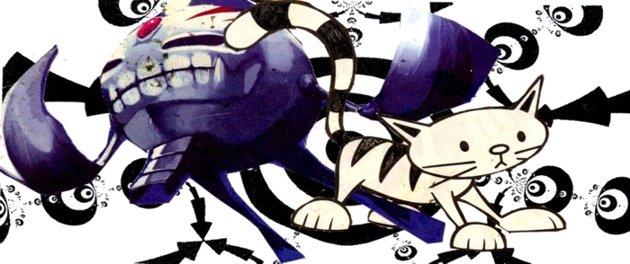
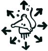

    free networks are paths through the woods 
    paths that lead interesting places grow 
    paths that lead nowhere disappear

    reseaux libres sont des chemins dans les bois 
    les chemins qui menant a des endroits interessants grandir 
    les chemins qui ne menent nulle part disparaitre  

## ideas-art-information on free networks of all kinds...
This site is for spreading/sharing/creating a low tech network.  Decentralised, community run alternatives to commercially 'provided' communications and energy.  Linking existing projects, trying out new ideas, and questioning what we really need. 

Before trying to re-create what is currently available commercially, a critical approach is taken.  Identifying problems, such as that computer use pacifies us physically; and centralised communication networks encourage interactions which are abstracted from our physical surroundings.

Communications are essential to our social organisation.  The ideas presented here focus on becoming more autonomous, to enable us to move from the cities to more rural or isolated areas, gaining access to land to grow food and medicinal plants and having time and space and a medium to develop our ideas.

And whatever else you/me/we find interesting.  Little attempt is made to separate practical information from  art/ideas/dreams, which to some may seem disorganised...   

An idea is to use modified radio equipment to link different kinds of existing networks and adapt to the chaotic situations we live in.  Existing projects seem to be shifting towards using higher an higher frequencies as the bands become become more crowded and people want more bandwidth (5GHz etc).  Another approach could be to use lower frequencies and lower bandwidth, for a more robust communication solution for rural areas and less directional, allowing more ad-hoc 'random' connectivity (rather than point-to-point links).    

The physical and geographical limitations of using decentralised radio networks could actually be an advantage, encouraging us to interact locally, with a network topology which reflects our capability to interect physically.  There is still the possiblity of long distance communication, but the nature of the topology means you are more likely to find things which are geographically nearby.  

For some years, this site was a wiki.  It is currently a static site, but will become again a wiki soon!  It was stagnating, not getting updated, mainly because mediawiki sites are tricky to edit offline and i seem to spend a lot of time offline or with a bad internet connection.  I will change to a wiki software with flat files.  Or use an open git repository for content. But for now this site remains static. 

Paper versions of parts of this site are also in distribution.

## sections of this site
* [community run communication](community_run_communication.md) main article including sections on [community run communication#amateur radio|amateur radio], [pirate radio broadcast](community run communication.md#pirate radio broadcast), [community run communication#wifi mesh or point to point|wifi networks] and [community run communication#software defined radio|software defined radio]

* [free networks](free_networks.md) short zine introduction to idea of free networks (french/enghlish) Note that this consists of images and may take time to load. 
* [430mhz data transfer](430mhz_data_transfer.md) a project being tested - like normal 2.4GHz wifi, but lower frequency to not need a line-of-sight link
<!--* [changing the internet] groups and projects for making the existing internet more free, as well as tools for those who do not have constant access to internet. -->  
* [alternative energy](alternative_energy.md) off-grid systems - wind, solar, batteries, and eco-construction 
* [plants, health, food and gardening](plants.md) and compost toilets
* [open source tech](tech_open_source.md) software and hardware
* [water](water.md) containers, wells, pumps, drainage
* [squatting/travelling/land rights](squatting_travelling_land_rights.md)
* [magic](magic.md) emergence, stigmergy, chaos
* [the blockchain](blockchain.md) the technology behind bitcoin, and its social impact, good or bad.
* [mousing about in a cisted twity](mousing_about.md) zine about city life.  we lived in all the spaces they were too busy to notice.  we danced after they'd gone to bed, and feasted on their crumbs. 
* [art/wierd/party](art_wierd_party.md) / [biscuits](biscuits.md) image board / [urban regeneration](urban_regeneration.md) drawings / [bad songs](bad_songs.md) 
* [other stuff](other_stuff.md) and [unsorted links](links.md) 

<!--[File:dannicard_sm.jpg|center]-->
<!-- 
 
  {{#ev:youtube|LlgNfQv74_g}}
{{ youtube>large:LlgNfQv74_g }}[http://www.myspace.com/oskur|vj oskur]
-->

<!-- [File:hertz.jpeg|100px|center|hertz] -->

this site is hosted at [ehion.com](http://ehion.com ehion.com) and was previously using mediawiki (the software used for wikipedia), and before that it was dokuwiki, a simpler php software [here is the old dokuwiki site](http://ehion.com/~ameba/doku.php), and before that it was [hosted on wikispaces](http://ameba23.wikispaces.com/) a free wiki hosting service, and before that a static html site on a server called **Hades**, at least 10 years ago.  It will maybe switch soon to 'moinmoin' or 'awkiawki' or another wiki software which uses flat files rather than a database, easier for editing offline or directly on the server.

