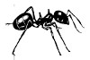

-   [Stigmergy](http://en.wikipedia.org/wiki/Stigmergy) a spontaneous,
    indirect coordination of actions, where the result of one action
    stimulates the performance of a subsequent action.  This is actually what is happening.  Natural order.  All the time.  It is the small things that matter.  Many tiny, low level interactions bring about high level complexity and beauty.  Ignore politicians, talk to the people around you.  We are all ants.

-   [Introducing chaos, Ziauddin Sardar](http://ebookee.org/Introducing-Chaos-New-Edition_236431.html) PDF ebook

-   [Conway's Game of Life](http://en.wikipedia.org/wiki/Conway%27s_Game_of_Life) when i first saw these computer animations i was shocked to see life-like movements coming out of such stupidly simple program. 
-   [Emergence - Wikipedia](http://en.wikipedia.org/wiki/Emergence) more order out of chaos.
-   [ECCO](http://ecco.vub.ac.be/?q=book/export/html/96)
-   [the tao of physics - Fritjof Capra](https://www.dmt-nexus.me/Files/Books/General/The%20Tao%20Of%20Physics.pdf)
    also his book 'the web of life' is worth reading
-   [Mandelbrot set - Wikipedia](http://en.wikipedia.org/wiki/Mandelbrot_set) simple mathematical formular.  Never-ending complex, beautiful and unpredictable patterns.  Not designed but discovered.
-   [Julia set](http://en.wikipedia.org/wiki/Julia_set) wikipedia article
-   [Goedel, Escher, Bach: An Eternal Golden Braid](http://gen.lib.rus.ec/book/index.php?md5=A5B5F92AD86359442A7362C02CE4AF03)
    book by Douglas Hofstadter. a metaphorical fugue on minds and
    machines in the spirit of Lewis Carroll.
-   [Turtles, termites and traffic jams: explorations in massively parallel microworlds -Mitchel Resnick](http://gen.lib.rus.ec/book/index.php?md5=E05CC3D12B1CE80EDC2349FDC316AB78)
-   time to do the [23 skidoo](http://en.wikipedia.org/wiki/23_skidoo_%28phrase%29)
- find catalytic hypercycle picture
