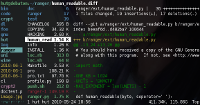
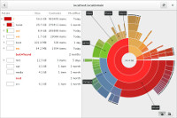

# tech

Most of this page is about open source software. A lot commercial software is easy to use and works straight out of the box.  However you are less in control, there may be unwanted hidden features, and you are constantly required to buy new hardware.  Many of the packages
listed are fast and light on system resources but can take time to learn how to use.

* [LibrePlanet](https://libreplanet.org/) wiki about free software community and campaigns

## GNU/linux

* [Arch Linux](https://www.archlinux.org/) rolling release, meaning the lastest packages are always available. supportive user community, and huge user software repository (AUR).  Very configurable on installation.  Great package documentation on the wiki which you will find usefull whichever distribution you use.  The entire wiki can be downloaded for reading offline. 
* [Debian](https://www.debian.org/index.en.html) 'the universal operating system'. Many different computer architechtures are supported, a big, supportive user community, a huge pre-compiled software repository, and different builds for stable, unstable and testing.  Debian is purist about free software.  Only completely non-proprietory packages are included in the official repository.  Of course it is very easy to also install non-free packages, and a bundle of non-free extras (such as codecs for mp3, etc) can be downloaded.  Many of the very popular linux distributions (eg. Ubuntu) are based on debian.  The default desktop environment, currently gnome3, is in my opinion annoying, but it is easy to change it. 
* [DistroWatch.com](http://distrowatch.com/) website with a lot of information about the
    different linux distributions.
* [UNetbootin](http://unetbootin.sourceforge.net/) Software to create
    bootable usb linux system (useful for installing linux). Runs also on windows and mac. 
* [The Linux Documentation Project](http://www.tldp.org/)

## window managers

* [i3](http://i3wm.org/) - great tiling window manager.  tiling window managers allow more keyboard rather than mouse control.  If you find yourself rarly using the mouse and using keyboard shortcuts to switch windows (eg: Alt+Tab) its time to switch to a tiliing window manager.  once you get used to it is difficult to imagine ever going back to floating windows.  i3 has good support for multi-monitor systems. [Configuring i3](http://blog.tunnelshade.in/2014/05/making-i3-beautiful.html) [i3status: Generates status bar to use with i3bar, dzen2 or xmobar ](https://github.com/Gravemind/i3status) 
* [dwm] another great tiling window manager.  very lightweight. 
* [Openbox](http://openbox.org/) a basic floating window manager - you can
    install additional features yourself, making it very customisable
    but not working well straight out of the box. You will probably need
    to install tools for power mangement, networking, managing
    displays, etc.
* [urukrama's Openbox keybindings](http://urukrama.wordpress.com/2008/07/22/my-openbox-keybindings/)
* [awesome](http://awesome.naquadah.org/) tiling window manager -
    meaning windows are arranged with the keyboard into tiles. Good for
    if you dont like to use the mouse and also good for making the most
    of display space.
* [Comparison of Tiling Window Managers - ArchWiki](https://wiki.archlinux.org/index.php/Comparison_of_Tiling_Window_Managers)

## shell

### zsh

* [zsh](http://zsh.sourceforge.net/) the zsh shell. an alternative to bash with a lot of features.  I've been using it for a while and just keep discovering good stuff.  You can get lost in configuring it yourself, so I would recommend using it with a configuration framework such as Prezto (see below).  
   * In zsh, type ls \*\*/\*.txt to find all txt files deeper in the directory structure.
   * [strcat.de/zsh](http://strcat.de/zsh/) many good zsh examples
   * [Master Your Z Shell with These Outrageously Useful Tips](http://reasoniamhere.com/2014/01/11/outrageously-useful-tips-to-master-your-z-shell/) 
   * [zsh-lovers man page](http://grml.org/zsh/zsh-lovers.html)
   * [prezto](https://github.com/sorin-ionescu/prezto) a configuration framework for zsh, that is a set of settings that you probably want to use.  otherwise you can get a bit lost in setting up zsh. 
   * [zmv](http://zshwiki.org/home/builtin/functions/zmv) 'zsh move' - powerfull file rename tool.  perfect for bulk renaming files. has a 'dry run' mode too. 
* FASD - This makes finding files and directories with the command line so much easier!
 It comes with some aliases, for example, instead of `cd` you can use `z` followed part of the name of the path
you want to move to. FASD will guess what you want, using 'frecency' (combined recency and frequency).  So whereever you are `z D` will take you to the most commonly/recently used directory with `D`, which might be `~/Downloads`.
`v xxx` will open vim with frequently/recently used file containing xxx.
`o xxx` will open the default application for the file. 
* URxvt - unicode terminal emulator.  Highly configurable, well maintained and supported.  
* [terminator](http://gnometerminator.blogspot.co.uk/) terminal emulator with many features, including tabs and split windows.  Some useful keys in terminator:
    * `Ctrl + Shift + O` Splits terminal hOrizontally.
    * `Ctrl + Shift + E` Splits terminal vErtically.
    * `Ctrl + Shift + Arrows` Move parent dragbar
    * `Alt + Arrows` Move to different terminals.

* GNU Screen - a great program which can be used for window splitting etc. over ssh.  You can also use it to start a process over ssh and then leave it running even after you disconnect from ssh.
* [tmux](http://tmux.sourceforge.net/) terminal multiplexer - another great tool for
    mouse free control of terminal windows and much more.
* [commandlinefu.com](http://www.commandlinefu.com) a website where people post useful (or simply nerdy) command line tricks.

* [30 handy bash aliases](http://www.cyberciti.biz/tips/bash-aliases-mac-centos-linux-unix.html)

* [dotfiles.github.io](dotfiles.github.io) good explanation of several dotfile repos and tools for managing dotfiles.
* GNU Stow -  Manage installation of multiple softwares in the same directory tree - can be useful for automatically creating symlinks to dotfiles.

## web

* [vimb] lightweight webkit based browser
* [vimprobable](http://sourceforge.net/p/vimprobable) another lightweight browser with vi style key bindings.  uses considerably less CPU than firefox/iceweasel.  Also allows tabs to be managed by your window manager. [Keybindings](https://sourceforge.net/p/vimprobable/wiki/Keybindings/) [Using Vimprobable - jasonwryan.com ](http://jasonwryan.com/blog/2011/06/26/using-vimprobable/) 
* [vimperator](http://www.vimperator.org) vi style control of
    firefox/iceweasel web browser. So you can control the web browser
    without using the mouse.
* [Surfraw](http://surfraw.alioth.debian.org/) 'Shell Users' Revolutionary Front Rage Against the Web' - open websites from the commandline.  a very handy program.  You can `alias sr="surfraw"` and do `sr wikipedia chard` from the command line to jump to wikipedia article about chard. See the [list of elvi](http://surfraw.alioth.debian.org/#elvilist) (website search scripts for surfraw).

* [GNUzilla and IceCat](https://www.gnu.org/software/gnuzilla/) firefox/iceweasel alternative 100% free software, no proprietory plugins recommmended

## tools, toys, reference

* [conky](http://conky.sourceforge.net/) system monitor
* [yadr](https://github.com/skwp/dotfiles) yet another dotfile repo. a
    bundle of configurations for vim, zsh, ruby and git. The idea is
    that rather than spending a lot of time configuring software, a
    collabourative effort is made to bring together sane configurations
    and plugins etc.
* yaourt - wrapper for arch linux's pacman - install packages from arch user repository easily 
* [aap](http://www.a-a-p.org/) makes it easy to download, build and
    install software
* [calmar.ws](http://www.calmar.ws/) tips and info on linux,vim,
    vimperator, awesome, other stuff
* [refcards.com](http://www.refcards.com/) free quick reference cards
* [fcron.free.fr](http://fcron.free.fr) apparently good for running
    cron jobs on a system which is not always switched on.
* [OpenVZ](http://openvz.org/Main_Page) container based vitualisation
    for linux.

## vim text editor

Learning vi or vim takes a while. But if you edit a lot of text files it
is worth learning. The keybindings in vim are used in a lot of other
programs, and vim is installed on a lot of different systems which makes
it a very useful thing to know, even if you just know the very basics.  It has really a lot of features and plugins available.

* Vundle - plugin manager for vim - find and install plugins from within vim
* NERDTree - plugin for file browsing 
* CtrlP - fuzzy file finder plugin - start typing some part of the path/filename and Ctrlp finds it. 
* fugitive - git wrapper plugin - use git without leaving vim
* [vi cheat sheet](http://www.lagmonster.org/docs/vi.html)
* [vim tips](http://zzapper.co.uk/vimtips.html)
* [vim mediawiki editing](http://blog.bigsmoke.us/2009/07/10/vim-mediawiki-editing)
* [vim tricks](https://github.com/rzetterberg/case_studies/blob/master/notes/2_vim_tricks.md)

## file management

* [ranger](http://ranger.nongnu.org/)
    terminal based file manager with vi style keybindings and many
    features including 'rifle' file opener, previewing, tabs,
    bookmarks, tagging. ranger is not a two pane file manager like mc or
    vifm, but uses 'miller columns' showing the directory hierarchy
    (similar to mac os 'finder'). The centre column is active, the left
    column the higher level directory, and the right column shows either
    a deeper directory or file information or preview.
* [mc](https://www.midnight-commander.org/) Midnight Commander - 2
    pane terminal based file manager (norton commander style)
* [vifm](http://vifm.info/) vi file manager. Two pane and with vi
    style keybindings
* [xfe](http://roland65.free.fr/xfe/) X File Explorer - light file
    manager for x-windows. Can have 2 pane and directory tree. Some
    norton commmander style keybindings.
* [gnome commander](https://gcmd.github.io/) File manager for gnome,
    norton commander style.
* [gentoo](http://www.obsession.se/gentoo/) Light, fast 2 pane file
    manager
* [SpaceFM](http://ignorantguru.github.io/spacefm/) multi-panel tabbed
    file and desktop manager
* [Baobab](https://wiki.gnome.org/Apps/Baobab)
    gnome disk usage analyser - graphical representation of disk usage -
    great for when you are trying to free up space
* [ncdu](http://dev.yorhel.nl/ncdu) - NCurses Disk Usage, a simple,
    fast program for analysing disk usage.
* [sshfs](http://fuse.sourceforge.net/sshfs.html) mount a remote
    filesystem via ssh

## email

* [mutt](http://www.mutt.org/) - email program. Its not for everyone,
    it takes a lot of configuring but once you have got it right it can
    work well and save time.
* [Steve losh's mutt guide](http://stevelosh.com/blog/2012/10/the-homely-mutt)
* [mu](http://www.djcbsoftware.nl/code/mu/) (maildir-utils) program
    for searching email stored in maildir format. To index your emails, `mu index --maildir=mymail` You can do this for
several mail directories, and you may want to set it up as a cron job to
periodically index your new emails. `mu find cabbage` will show emails
about cabbage. You can also bind `mu find` to a key in mutt, and have
the results stored as a temporary maildir, which can accessed in mutt:
(from [mutt wiki](http://dev.mutt.org/trac/wiki/UseCases/SearchingMail))

first macro does the search according to user query, second macro jumps to results list

     macro index <F8> "<shell-escape>rm -rf ~/.mu/results; mu-find -o l -l ~/.mu/results " "mu-find"
     macro index <F9> "<change-folder-readonly>~/.mu/results\n" "display mu-find results"

* [notmuch](http://notmuchmail.org) another great program for searching email
* [mutt sidebar](http://www.lunar-linux.org/mutt-sidebar/) patch for
    mutt with folders listed in a sidebar - you will need to set up keybindings to go with it
* [getting up and running with a sane mutt setup](http://blog.developwithpassion.com/2013/05/02/getting-up-and-running-with-a-sane-mutt-setup/)
* [realprogrammers.com mutt guide](http://realprogrammers.com/jump_start/mutt/)
* [How I tamed my mutt – cmdln.org (a sysadmin blog)](http://www.cmdln.org/2008/11/07/how-i-tamed-my-mutt/)
* [fefe.da Mutt FAQ](http://www.fefe.de/muttfaq/faq.html)
* [Mailman](http://www.gnu.org/software/mailman/index.html) GNU
    Mailing list manager
* Neomutt

### non-commercial email providers

These email providers are non-commercial groups which take security and
privacy seriously. Please add more

* [aktivix](https://aktivix.org/) (uk)
* [immerda](http://www.immerda.ch) (ch)
* [systemli.org](http://www.systemli.org) (de)
* [riseup.net](http://mail.riseup.net) (us)
* [mtmedia.org](http://mtmedia.org) (de)

## graphics

* [gimp](http://www.gimp.org/) -the GNU image manipulation program - a gui graphics editor (like adobe photoshop)
* [inkscape](http://www.inkscape.org) gui vector graphics editor (like
    corel draw)
* [feh](http://feh.finalrewind.org/) a fast and light image viewer.  you can go to your photos folder and type `feh -Frz` to randomly see photos in all subdirectories.  can also be used to display wallpaper.  keybindings: 
    left/right - previous/next image
    up/down - zoom
    / - zoom to fit window
    d - toggle display filenames
    Ctrl + delete - delete file
    m - menu
Feh command line switches:
    F - fullscreen and scale large images to fit screen (often what you want)
    r - recursive (enter directories)
    z - randomise file list
    A - customisable action   eg: feh -A "cp %n ~/pics", then press 0 to do the action.  very useful!

* [imagemagick](http://www.imagemagick.org/) powerfull command line tools for
    converting, editing and composing images. Good for batch
    image processing.  very useful for web development.  use 'convert' for a many image processing tasks, including resizing and changing format. `mogrify` is the same as convert but modifies the input file directly, rather than producing a new output file.  very useful, but use with caution.  
* [graphicsmagick](http://www.graphicsmagick.org) a fork of
    imagemagick - apparently more efficient.
* [G'MIC](http://gmic.eu/) GREYC's Magic for Image Computing - an
    image processing framework. Commandline tools, Gimp plugin and
    C++ library.

## document and book viewers

* [MuPDF](http://www.mupdf.com/) - a superfast, lightweight pdf viewer with some vi style keybindings. 
    f = toglle fullscreen mode
    W, H - zoom page to exactly fit width or height of window
    <, > - skip back or forwards 10 pages

* [apvlv](http://naihe2010.github.io/apvlv/) - another pdf viewer,
    vi style.
* [calibre](http://calibre-ebook.com/) - ebook library manager
* [FBReader](http://fbreader.org/) reader for epub etc

### electronic books

* [gen.lib.rus.ec](http://gen.lib.rus.ec) library genesis. Huge
    book collection. Particularly a lot of science type stuff. Based in
    russia, with many mirror sites, it is also possible to set up your
    own mirror or offline repository, the SQL database dump can
    be downloaded. Some ISPs are beginning to block library genesis,
    which means you need to find a mirror which is not blocked, or
    access it through TOR or a VPN.
* [Project Gutenberg](https://www.gutenberg.org/) One of the oldest
    free ebook collections on the net. 46,000 titles.
* [internet archive](https://archive.org/) also hosts many books.
* [<http://clockwise3rldkgu.onion/>](http://clockwise3rldkgu.onion/)
    clockwise libraries - a good ebook library online available
    through TOR.
* [magsDB](http://magsdb.org) magazines database (russian site)
* [resrc.io](http://resrc.io/) list of free programming language
    resources
* [DIY Book Scanning](http://www.diybookscanner.org/) a community
    devoted to DIY/low cost book scanning hardware and software
* [Book scanning wikipedia
    article](http://en.wikipedia.org/wiki/Book_scanning)
* [openlibrary.org](https://openlibrary.org/) ebooks

## backup/archiving

* [rsync](http://rsync.samba.org/) - a powerful backup/file
    copying tool. rsync only copies differences in the files, to
    minimise the amount of data being transfered. This means it responds
    well to transfers which are interupted and restarted. Commonly used
    options:
  * `rsync dir1/ dir2`   -note the slash, to put the contents of dir1 into dir2 (often this is what you want)
  * `-a` =archive mode - recursive, preserve times, permissions etc (often what you want)
  * `-v` verbose
  * `--progress` show progress
  * `-n` dry run - dont actually do it, just show what would happen.  this is very useful for experimenting with features before running a big backup or potentially doing something very stupid
  * `--delete` delete files in the destination directory that were not in the source directory.
  * `-u`  update - skip files that are newer on the reciever.  This can be run in both directions to syncronise
* [Grsync](http://www.opbyte.it/grsync/) - rsync graphical frontend for Linux
* [unison](http://www.cis.upenn.edu/~bcpierce/unison/) file syncroniser. Unlike rsync, unison ensures both filesystems have the newest version of a file. [tutorial on setting up unison](http://www.howtoforge.com/setting-up-unison-file-synchronization-between-two-servers-on-debian-squeeze)

 * `diff -qr source destination` show the differences between directories.  Options are brief and recursive.
 * `comm -3 <(ls ~/dir-new/) <(ls ~/dir)` compare two directories

Find duplicate files:

    find -not -empty -type f -printf "%s\n" | sort -rn | uniq -d | xargs -I{} -n1 find -type f -size {}c -print0 | xargs -0 md5sum | sort | uniq -w32 --all-repeated=separate

Find and delete duplicate files:

    find -not -empty -type f -printf "%s\n" | sort -rn | uniq -d |  xargs -I{} -n1 find -type f -size {}c -print0 | xargs -0 md5sum | sort | uniq -w32 --all-repeated=separate | cut -f3-100 -d ' ' | tr '\n.' '\t.' | sed 's/\t\t/\n/g' | cut -f2-100 | tr '\t' '\n' | perl -i -pe 's/([ (){}-])/\\$1/g' | perl -i -pe 's/'\''/\\'\''/g' | xargs -pr rm -v

## network attached storage (NAS)
* [nas central](http://www.nas-central.org) wiki about hacking NAS devices.

## booklet printing on linux
some tools, for example, for reordering pages of an a4 documents to make an a5 booklet or zine.
 
   pdf2ps                                              # convert a pdf document to postscript      
   psbook in.ps out.ps                                 # reorder the pages to make a book,  
   psnup -s1 -2 book.ps booklet.ps                     # shrink to 2 pages on each A4 side
   ps2pdf in.ps out.pdf                                # convert it back to a pdf

If you dont have a duplex printer probably you want to print the even pages, put them in the paper drawer (the right way around! very confusing!) then print the odd pages 
   lpr -P myprinter -o page-set=even -#1 infile.pdf    # print the even pages  
   lpr -P myprinter -o page-set=odd -#1 infile.pdf     # print the odd pages

## encryption
* [cryptoparty handbook](https://www.cryptoparty.in/documentation/handbook) plenty of information
* [gpg](http://www.gnupg.org/) Gnu Privacy Guard.  Tool for encrypting files and email. Most simple usage - gpg encryption of a single file:
    gpg -c file
This prompts for a password and gives file.gpg.  To decypt: 
    gpg -d file.gpg >` file`

* [Disk encryption article on ArchWiki](https://wiki.archlinux.org/index.php/Disk_Encryption) a good explanation of disk encryption and a comparison of the methods.
* truecrypt

## tools for those who have little or no connection to internet

* evopedia - offline wikipedia reader.  
* [kiwix](http://www.kiwix.org) wikipedia offline reader - read
    wikipedia when not connected to internet. The english wikipedia
    (text only, no images, user pages or discussion pages) compresses to
    about 8gb! You will need to download this data in 'zim' format,
    available as a torrent. [list of wikipedias](http://www.kiwix.org/wiki/Wikipedia_in_all_languages).  Currently not supported on debian.
* [openstreetmap](http://www.openstreetmap.org) collaborative
    mapping project. it is also possible to download openstreetmap (even
    the whole planet) for offline viewing using a software called
    [navit](http://www.navit-project.org/) (which i still havent
    succussfully used), other software projects are Gosmore, Emerillon
    and Marble. It seems that rendering map tiles from a downloaded map
    takes a lot of computing and rendering software tends to be designed
    for servers. I have not found downloadable pre-rendered tiles for
    easy, fast offline viewing. Any ideas? It would be great to have
    quickly accessible offline maps.
* [OfflineIMAP](http://offlineimap.org) software for syncronising
    imap mailboxes. It is useful for unreliable or slow internet
    connections or when you want to read email offline.
* [hitchwiki.org](http://hitchwiki.org) the excellent hitchhiking website can also be downloaded to view
    offline [hitchwiki while offline](http://hitchwiki.org/en/Hitchwiki:While_offline). The
    database is downloaded in XML format which can be viewed with
    various kinds of dictionary viewing software.

### offline dictionary for linux
* [dict](http://sourceforge.net/projects/dict/) great dictionary software with many dictionaries available.
* [goldendict](http://goldendict.org/) uses freedict dictionaries.
* [Ding](https://www-user.tu-chemnitz.de/~fri/ding/) A very good German-English dictionary lookup program

## filesharing

* [t411](http://www.t411.in) good torrent tracker (french) requires registration and has advertising but some really good stuff on there. 'Telecharger'='Download'
* [rutracker.org](http://www.rutracker.org) good torrent tracker (russian) also requires registration.
* [zeropaid](http://www.zeropaid.com) filesharing news and forum
* [myananamouse.net](https://www.myanonamouse.net) torrent site
    specialising in english ebooks and audiobooks. it is a private site
    with a complicated regestration process and many rules, but there is
    a lot of books on there.
* [tracker2.postman.i2p](http://tracker2.postman.i2p) i2p torrent
    tracker (you must be running i2p to access)
* [imule](http://www.imule.i2p) p2p sharing software for i2p (also an
    i2p eepsite)
* [eiskaltdc++](https://code.google.com/p/eiskaltdc/) and
    [linuxDC++](https://launchpad.net/linuxdcpp) are linux clients for
    the Direct Connect filesharing protocol.
    [uhub](https://www.uhub.org/) is hub software (server).
* [soulseek qt](http://soulseekqt.net) music sharing network
    client software. [nicotine](http://nicotine-plus.sourceforge.net/)
    is a soulseek client written in python

## audio software

* [hydrogen audio](http://www.hydrogenaudio.org) forums about audio
    software etc
* [rockbox](http://www.rockbox.org/) open source firmware for music
    players, eg. ipod. Very useful if the original firmware wont play
    certain formats, or has restrictions on copying music off
    the player. Can run on Sansa clip (a highly recommended mp3 player).
* [mpd](http://www.musicpd.org/) music
    player daemon. music playing software designed to be run over
    a network.  But it is also very good when client and daemon are running on the same computer.  If there is a network attached computer connected to an amplifier and running mpd, other computers on the network can
    control the player by using mpd client software (of which there are
    many to choose from, i use [ncmpcpp](http://ncmpcpp.rybczak.net)).
    Can run on raspberry pi.  The database is very fast to update
    and search.  I previously always avoided database driven players because of speed, bloated software, and inability to access my catagoried directory structure where I know where to find things.  Most mpd clients allow browsing by directory structure as well as database, and its playlist management system is good.  The really great thing is, you can decide to change client software without setting up the database again.  Also easy to set up status viewing in a system monitor or keybindings in your window manager, so you can control the player whilst using other software.  A must for big music collections.  
* [cmus](http://cmus.sourceforge.net) curses based music player
    software (linux, console based). with playlists, play queue,
    filtering, vi style search and command mode, dynamic keybindings.
* [moc](http://moc.daper.net/) another, simpler, curses based player.
    moc has two panels, with a similar look to midnight commander. On
    the left panel is a file browser and the right is a playlist.
* [randomplay](https://packages.debian.org/sid/randomplay) even
    simpler console player. plays random tracks.
* [DeaDBeeF](http://deadbeef.sourceforge.net/) GUI music player. Lightweight, extendable with plugins, and has tabbed playlists and a design editor similar to [foobar2000](http://www.foobar2000.org/) (a very good windows music player).
* [beets](http://beets.radbox.org/) music collection organising tool. Useful for tagging and organising a large collection.
* [gmusicbrowser](https://gmusicbrowser.org/) jukebox software
    designed for a large music collection
* [Linux multimedia studio (LMMS)](http://lmms.sourceforge.net/) free music production software, with VST compatibility.
* [sox](http://sox.sourceforge.net) command line sound tool. can be used as simple synthesiser, and to convert audio formats.
* [Mumble](http://mumble.sourceforge.net/) voice chat software. Mumble was originally developed for chat whilst gaming and is now also popular for conferencing etc.  
* [audacity](http://audacity.sourceforge.net/) free audio editor and recorder.
* [Mixxx](http://www.mixxx.org/) Open source DJ software. For
    monitoring (listening to the next track to be played on
    the headphones) it is best to have a soundcard with
    multiple outputs. Many soundcards have surround sound, meaning you
    can use the 'front' channels for output and the 'rear' channels
    for monitoring. A cheaper way to do it would be to use two
    soundcards, for example your computer's on-board card for main
    output and a cheap USB card for monitoring. An even cheaper way
    might be to use the left channel for ouput and the right channel
    for monitoring. Mixxx also works with various types of midi
    hardware, so you can control pitch, cueing, equalisers and other
    stuff with real twiddley knobs and sliders.
* [xwax: Digital vinyl on Linux](http://xwax.org/) Open source software for DJing using time-coded vinyl (like Serato scratch, etc).  The playback of a digital track is controlled using normal record decks with special records.  Like having every record you ever wished for.  Well of course really having the records would be better, but its a lot of fun.  xwax can work together with Mixxx.
* [tweakheadz](http://www.tweakheadz.com) has guides on making music with software and hardware
* [mps-youtube](https://github.com/np1/mps-youtube) terminal based youtube player and downloader. very good for finding and downloading music fast, without the clutter of the youtube website.
* [ccmixter.org](http://ccmixter.org/) online community for musicians, hosting a lot of creative commons lisenced audio.
* [soulseek qt](http://soulseekqt.net) music sharing network. [nicotine](http://nicotine-plus.sourceforge.net/) is a good soulseek client written in python
* [vitunes - a curses media indexer and player ](http://vitunes.org/)

to take 30 random mp3s and put them in a directory (i use this to
randomly choose some of my music to put onto my mp3 player):

`find -name "*.mp3" | sort --random-sort | head -n 30 | xargs -n 1 -i^Cd '\n' cp {} /media/mp3player/randomtunes`

## audio hardware

* [diyaudio.com](http://www.diyaudio.com) forums about diy audio
    hardware projects
* [tweakheadz](http://www.tweakheadz.com) has guides on making music
    with software and hardware
* [vintagesynth.com](http://www.vintagesynth.com) online resource for
    vintage synthesisers and other audio hardware
* [Standuino](http://www.standuino.eu/standuino/project/) DIY open
    source audio hardware
* [speakerplans.com](http://www.speakerplans.com/) designs for speaker
    enclosures
* horn response - speaker enclosure design software. can use with
    abaca? audio abacus

## usenet

* [tin](http://www.tin.org/) text-based usenet newsreader software
* [eternal september](http://www.eternal-september.org) Free text only
    usenet provider (registration required)
* [aioe](http://www.aioe.org) free text only usenet provider (no
    registration required)

## other / uncategorised

Many of these links need to be (or already have been) put elsewhere on
the wiki

* [mighty ohm](http://mightyohm.com) some open source hardware designs
    and a soldering guide in many languages
* [Desoldering - wikipedia
    article](http://en.wikipedia.org/wiki/Desoldering) for learning how
    to recuperate electronic components.
* [Desoldering
    wikibook](http://en.wikibooks.org/wiki/Practical_Electronics/Desoldering)
* [circuit circle](http://circuitcircle.de) / [SCHRÄGERUNDE](http://schraegerunde.blogspot.de/) DIY electronics and circuit bending -workshops, concerts, installations, performances
* [Toner refill - wikipedia
    article](http://en.wikipedia.org/wiki/Toner_refill) on refilling
    photocopier laser printer toner

* [freemusicarchive.org](http://www.freemusicarchive.org)
* [internet archive](https://archive.org/) archive of internet sites,
    also many media files hosted here, you can put media files here too.
* [Use google translate from the command
    line](https://github.com/Anoncheg1/Command-line-translator) with
    some extra features.
* [Google translate awk
    program](https://github.com/soimort/google-translate-cli) very
    similar
* [open frameworks](http://www.openframeworks.cc) c++ library for
    creative projects
* [RONJA](http://ronja.twibright.com/) free technology project for
    optical point-to-point data links (using visible light). The design
    has a reported 1.4km range and 10Mbps full duplex data rate.
* [modulatedlight.org](http://www.modulatedlight.org/) information and
    experiments using light for data links, mostly using high power LEDs
    rather than lasers, as they work better over long distances.
* [ttfa.net/12volt](http://ttfa.net/12volt)
* [A Tao of regular expressions](http://www.let.uu.nl/~Michael.Moortgat/personal/Courses/TT02/tao_regexps.html)
    notes on using regular expressions (for vi, grep, etc)
* [mattmahoney on data compression](http://mattmahoney.net/dc/) much
    info on data compression. PAQ8 text compression, while
    computationally expensive, could be very useful for low-bandwidth
    radio data networks.
* pbx
* x25, a kind of [packet switched network](http://en.wikipedia.org/wiki/Packet_switched_network)
* [skype like conferencing system](https://www.johncahill.net/wiki/index.php/Skype_like_conferencing_System) software project proposal. see also ZRTP and SRTP
* [sdf.org](http://sdf.org) sdf public access unix system
* [retroshare](http://retroshare.sourceforge.net/) secure, decentralised communication and filesharing platform
* [nmap](http://nmap.org/) network ping scan tool
* [wikidata](http://meta.wikimedia.org/wiki/Wikidata) - project to put wikipedia information into a semantic format, linking topics across languages and categories.

Unsorted links:

* [Open source software and nice hardware box.matto.nl ](https://box.matto.nl/index.html) Tags: software linux
* [The Best MOTD - How to Customize Your MOTD - Linux ](http://www.mewbies.com/how_to_customize_your_console_login_message_tutorial.htm) Tags: motd
* [Pandoc - About pandoc ](http://pandoc.org/) Tags: pandoc markdown converter software
* [Troubleshooting Laptop Power Problems ](http://www.uofr.net/~greg/hardware/laptop_power_troubleshooting/) Tags: fixing laptop power problems
* [Laptop Won't Power On - Troubleshooting a AC/DC Adapter Problem and Laptop Power Connector ](http://www.ifitjams.com/lappower.htm) Tags: laptop power problem
* [The updated big list of static website generators for your site, blog or wiki ](https://iwantmyname.com/blog/2014/05/the-updated-big-list-of-static-website-generators-for-your-site-blog-or-wiki.html) static website generators simple
* [GitHub Pages - Websites for you and your projects, hosted directly from your GitHub repository. Just edit, push, and your changes are live. ](https://pages.github.com/) free hosting
* [Jekyll - Simple, blog-aware, static sites ](http://jekyllrb.com/docs/usage/) static site generator (used by github)
* [Pico ](http://picocms.org/docs/) lightwieght content management system
* [Phrozn - Static Site Generator for PHP ](http://phrozn.info/en/documentation/articles/getting-started/) Tags: phrozn static site generator php
* [The JavaScript Trap ](http://www.gnu.org/philosophy/javascript-trap.html) Tags: stallman gnu javascript trap
* [Save WiFi - LibrePlanet ](https://libreplanet.org/wiki/Save_WiFi) Tags: save wifi firmware lockdown
