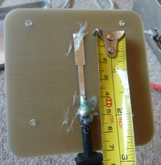
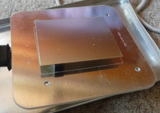
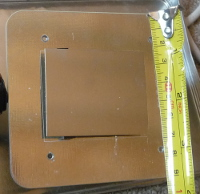

Photos of inside a commercial 2.4Ghz directional antenna (by TP-Link) to
give ideas on DIY design.

-   [TL-ANT2409B](http://www.tp-link.com/en/products/details/?model=TL-ANT2409B)
    product page

 

