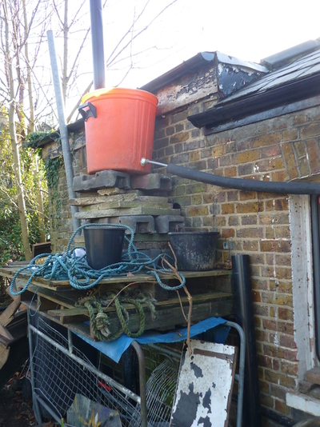

a gravity powered running water system in london

water containers
----------------

some people prefer not to use plastic because of plastic particles
contaminating the water. military metal jerry cans are practical but
expensive.

plastic containers with taps do not last a long time - the tap gets
damaged while carrying and starts to drip. they are also quite time
consuming to use although good for children because you dont have to
lift the container to get water.

Cooking oil is sometimes sold in 10 litre plastic containers, which can
be found discarded by restaurants etc, and make practical water
containers.

living outside in winter when it is very cold remember to fill up the
kettle before you go to bed because you cannot get frozen water out of a
plastic container.

water wells
-----------

Depending on the soil and how deep the water level is, small diameter
wells can be drilled by hand using an extendable bore tool, usually up to
6m deep.  A bigger tool can be lifted on a tripod above the well site, and turned with two people.  Depending on whether you have sand or clay, you may need to repeatedly drop a hammer-like tool from the tripod which collects earth inside it.  Sections of steel pipe are inserted as the well is drilled, and are welded together.  

Bigger diameter wells can be dug, but of course there is a danger that they collapse.  One technique is to use a concrete
tube in sections and dig around the bottom of it allowing it to
gradually move deeper as more sections are added from above.

Another technique is to dig a bigger hole of then insert concrete or
plastic tube. Successful wells have been made using 50cm diameter pipe
found on a building site, with holes drilled in the lowest meter and
some gravel (smalls stones) added to the bottom.

-   [Plans for a small diameter well](http://www.fdungan.com/well.htm)
-   [How to Drill Your Own Water Well](http://www.drillyourownwell.com/)

water pumps
-----------

With a large diameter well, a weighted bucket and string can be used.
However this is much work and if sharing with a large group of people,
the likely hood of spreading disease by everybody touching the bucket
and re-inserting it into the well becomes higher. This is also an issue
when washing your hands by scooping water with a bucket from a rain
water barrel. Running water is of course safest but not always possible,
and when water is limited having running water inevitably encourages us
to use more.

If buying an electric pump, consider that spending more initially could
work out cheaper long term. Immersion pumps are generally cheaper and
consume less power. But the cheapest ones, designed for emptying small
swimming pools, will quickly break if used all the time. With very small
diameter wells, tiny 12v immersion pumps can be used (these are also useful for siphoning diesel). Generally it is a
good idea to run pumps intermittently, for example on a timer switch,
and pump to a tank which is gradually topped up. Using a tank means you
can use water at a greater pressure than your pump allows, (so you have
plenty of water for showers in the morning after the tank is topped up
overnight) and gets around the problem of the delay in switching a pump
every time you need a small amount of water.  But of course it needs to be maintained, kept clean, and it can freeze in winter.

-   [Hand pump design on
    appropedia](http://www.appropedia.org/How_to_build_a_hand_powered_pump)
-   [bison pumps](http://bisonpumps.com/) commercial manufacturers of
    hand pumps

Hydrualic ram pumps can be used where there is flowing water (a stream
or river) to use the water pressure to pump a comparitively low amount
of water upwards, without the need for electricity.

-   [Hydraulic ram wikipedia
    article](http://en.wikipedia.org/wiki/Hydraulic_ram)
-   [ram pump design](http://www.clemson.edu/irrig/equip/ram.htm)

plumbing
--------

flexible plastic pipe is increasingly used instead of copper. At the
time of writing the price per meter is cheaper than copper but the
connections are most expensive making it work out and more or less the
same price depending on the length of runs. If using copper, solder
joints are cheaper than compression joints, but require a blowtorch.

Leaks in copper pipe can be temporarily fixed using bicycle inner-tubes.
they can be cut into strips and wrapped around the pipe very
tightly.

Hose pipe can be connected to copper or plastic pipe using jubilee
clips, provided the pressure is not too high.

Another cheap way of fixing leaks is to use
bitumen. Strips of hessian (sack cloth) are soaked in hot melted bitumen and then
used to patch up the leak.  very messy.

washing up liquid
-----------------

washing up liquid can be made from a mixture of wood ash and ivy leaves
boiled together in water for about an hour. coffee grounds or sand are also usefull for
cleaning greasy pots as well as greasy hands. horsetail (the plant) is
also usefull for washing up.

drinking water filtering
------------------------

-   Ceramic filters
-   12v UV filters

grey water filtering
--------------------

-   reed beds and other plants
-   Stones and sand for irrigation

